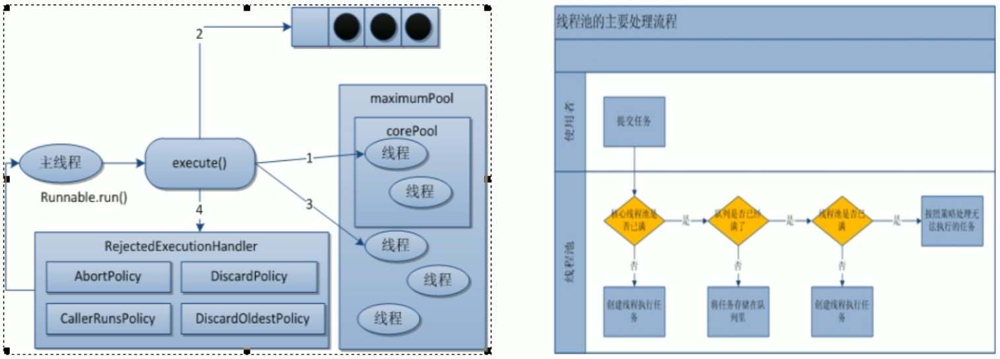
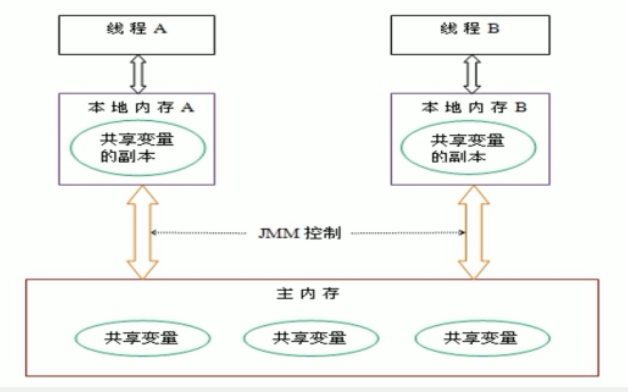
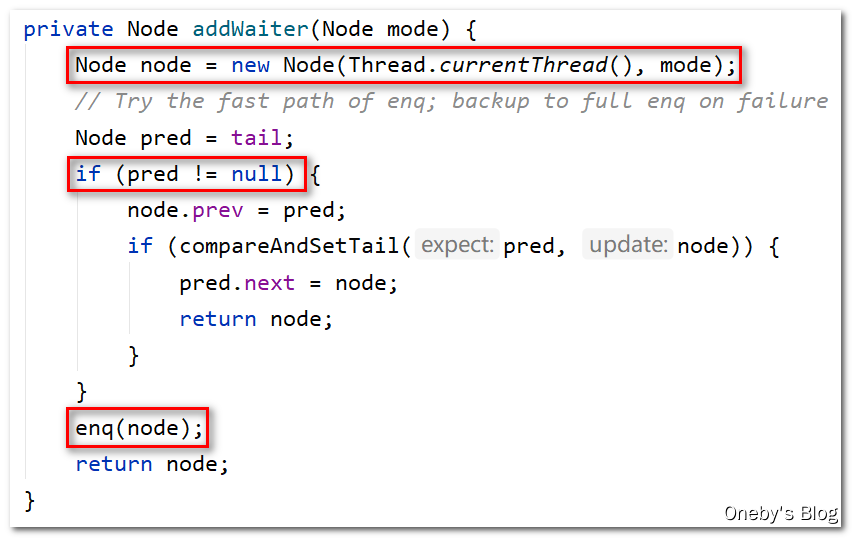
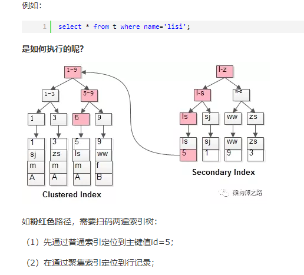
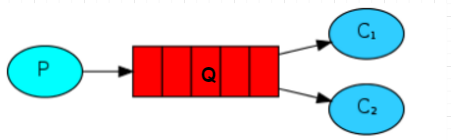

# Java基础

### 1. 继承，多态，封装，抽象


### 2. 重写和重载的区别

####  	2.1重写

​			从字面上看，重写就是 重新写一遍的意思。其实就是**在子类中把父类本身有的方法**重新写一遍。子类继承了父类原有的方法，但有时子类并不想原封不动		的继承父类中的某个方法，所以**在方法名，参数列表，返回类型(除过子类中方法的返回值是父类中方法返回值的子类时)都相同的情况下，** 对方法体进行修改		或重写，这就是重写。但要注意**子类函数的访问修饰权限不能少于父类的。**

#### 	  2.2重载

​			在一个类中，同名的方法如果有不同的参数列表（**参数类型不同、参数个数不同甚至是参数顺序不同**）则视为重载。同时，重载对返回类型没有要求，可以		相同也可以不同，但**不能通过返回类型是否相同来判断重载**。


### 3. 类加载顺序

​		父类的静态字段——>父类静态代码块——>子类静态字段——>子类静态代码块——>

​		父类成员变量（非静态字段）——>父类非静态代码块——>父类构造器——>子类成员变量——>子类非静态代码块——>子类构造器


### 4. final 关键字的作用

#### 	4.1用来修饰一个引用

​	   1.如果引用为基本数据类型，则该引用为常量，该值无法修改； 

​	   2.如果引用为引用数据类型，比如对象、数组，则该对象、数组本身可以修改，但指向该对象或数组的地址的引用不能修改。

​	   3.如果引用时类的成员变量，则必须当场赋值，否则编译会报错。	

```java
final class Person {
    String name ="zs";    //3. 此处不赋值会报错
    //final int age;
    final int age = 10;
}
public class Demo01 {
    public static void main(String[] args) {        //1. 基本数组类型为常量，无法修改
        final int i = 9;
        //i = 10;               //2. 地址不能修改，但是对象本身的属性可以修改
        Person p = new Person();
        p.name = "lisi";
        final int[] arr = {1,2,3,45};
        arr[3] = 999;
        //arr = new int[]{1,4,56,78};
    }
}
```

#### 	 

#### 	   4.2用来修饰一个方法

  			当使用final修饰方法时，这个方法将成为最终方法，无法被子类重写。但是，该方法仍然可以被继承。

#### 	 

####  	  4.3用来修饰类

​             当用final修改类时，该类成为最终类，无法被继承。简称为“断子绝孙类”。


### 5. static 关键字的作用

> 参考文献：https://www.cnblogs.com/swisszhang/p/9892992.html
>

static关键字最基本的用法是：

#### 	5.1 被static修饰的变量属于类变量，可以通过**类名.变量名**直接引用，而不需要new出一个类来

#### 	5.2 被static修饰的方法属于类方法，可以通过**类名.方法名**直接引用，而不需要new出一个类来

​	 5.3 被static修饰的变量、被static修饰的方法统一属于类的**静态资源，是类实例之间共享的，换言之，一处变、处处变**。JDK把不同的静态资源放在了不同的类		   中而不把所有静态资源放在一个类里面，很多人可能想当然认为当然要这么做，但是是否想过为什么要这么做呢？个人认为主要有三个好处：

​			1、不同的类有自己的静态资源，这可以实现静态资源分类。比如和数学相关的静态资源放在java.lang.Math中，和日历相关的静态资源放在  java.util.Calendar中，这样就很清晰了

​			2、避免重名。不同的类之间有重名的静态变量名、静态方法名也是很正常的，如果所有的都放在一起不可避免的一个问题就是名字重复，这时候怎么办？		分类放置就好了。

​			3、避免静态资源类无限膨胀，这很好理解。


### 6.==和 equals 的区别

####  6.1 ==

​     对于基本类型来说是值比较，对于引用类型来说是比较的是引用

####  6.2 equals 

​	默认情况下是引用比较，只是很多类重新了 equals 方法，比如 String、Integer 等把它 变成了值比较，

所以一般情况下 equals 比较的是值是否相等。


### 7. hashCode()与 equals()

​	  1.equals()相等的两个对象他们的hashCode()肯定相等，也就是用equal()对比是绝对可靠的。

​      2.hashCode()相等的两个对象他们的equals()不一定相等，也就是hashCode()不是绝对可靠的。


### 8. Java 泛型了解么？什么是类型擦除？介绍一下常用的通配符？

> 参考文献：[https://www.cnblogs.com/demingblog/p/5495610.html](https://www.cnblogs.com/demingblog/p/5495610.html)
>

#### 8.1 什么是 Java 泛型

​	泛型是Java SE 1.5的新特性，泛型的本质是参数化类型，也就是说所操作的数据类型被指定为一个参数。
​	这种参数类型可以用在类、接口和方法的创建中，分别称为泛型类、泛型接口、泛型方法。

>   通俗的讲，泛型就是操作类型的 占位符，即：假设占位符为T，那么此次声明的数据结构操作的数据类型为T类型。


#### 8.2 什么是类型擦除

　先看一个例子，Operate类如下：

```java
public class Operate {

    public static void main(String[] args) {
        List<String> names=new ArrayList<String>();
        names.add("Jack");
        names.add("Tom");
        names.add("peter");
        for(String name:names){
            System.out.println("wellcome:"+name);
        }
    }

}
```

其对应的class文件**反编译**之后，我们使用*java-gui反编译.exe*  查看编译之后的代码如下

```java
public class Operate {
    public static void main(String[] args) {
        List names=new ArrayList();
        names.add("Jack");
        names.add("Tom");
        names.add("peter");
        for(String name:names){
            System.out.println("wellcome:"+name);
        }
    }
}
```

> 发现没有，根本没有<String> 这一部分了。这个限制为String类型的泛型被“擦除”了。写代码的时候，泛型会做校验，类型不对应的，无法add,但是编译之后边去掉了泛型类型


#### 8.3 泛型通配符

我们在定义泛型类，泛型方法，泛型接口的时候经常会碰见很多不同的通配符，比如 T，E，K，V 等等，这些通配符又都是什么意思呢？

**常用的 T，E，K，V，？**

本质上这些个都是通配符，没啥区别，只不过是编码时的一种约定俗成的东西。比如上述代码中的 T ，我们可以换成 A-Z 之间的任何一个 字母都可以，并不会影响程序的正常运行，但是如果换成其他的字母代替 T ，在可读性上可能会弱一些。**通常情况下，T，E，K，V，？ 是这样约定的：**

- ？ 表示不确定的 java 类型
- T (type) 表示具体的一个java类型
- K V (key value) 分别代表java键值中的Key Value
- E (element) 代表Element


### 9.  Java 中的几种基本数据类型是什么？对应的包装类型是什么？各自占用多少字节呢？


###  10. Collection 集合如何排序

​		有一个列表：List list
​		现在使用 **Collections** 对其进行排序：

```java
public static void main(String[] args) {
    List<Integer> list = new ArrayList<>();
    list.add(3);
    list.add(10);
    list.add(2);
    list.add(5);
    Collections.sort(list, new Comparator<Integer>() {
        @Override
        public int compare(Integer o1, Integer o2) {
            return o1.compareTo(o2);//升序
        }
    });
    System.out.println(list);
}
```

​		如果列表里是个Map：List<Map<String,Object>> list
​		也可以使用 **Collections** 对其进行排序：

```java
public static void main(String[] args) {
    List<Map<String,Object>> list=new ArrayList<>();
    Map<String,Object> map1=new HashMap<>();
    map1.put("name","name1");
    map1.put("age",2);
    Map<String,Object> map2=new HashMap<>();
    map2.put("name","name2");
    map2.put("age",3);
    list.add(map1);
    list.add(map2);
    //按照map中total字段排序
    Collections.sort(list,new Comparator<Map<String,Object>>(){
        public int compare(Map<String,Object> o1 ,Map<String,Object> o2){
            Integer num1=(Integer)o1.get("age");
            Integer num2=(Integer)o2.get("age");
            return num2.compareTo(num1);   //降序
            //return num1.compareTo(num2); //升序
        }
    });
    System.out.println(list);
}
```


### 11.  AutoColse 接口做什么用的

> ​    在JDK1.7的时候就提出了一种自动关闭资源的想法，所以AutoCloseable接口就诞生了，查看AutoCloseable源码会发现，接口只有一个方法close()


```java
package java.lang;

public interface AutoCloseable {
    void close() throws Exception;
}
```


### 12. ThreadLocal 实现原理 数据结构 生命周期

> **参考文献：**https://baijiahao.baidu.com/s?id=1653790035315010634&wfr=spider&for=pc

### 13. volatile 修饰符的作用

> 参考文献：https://zhuanlan.zhihu.com/p/138819184
>

### 14. Error 和 Exception 区别

### 15.[正则表达式](file:///D:/Taimei/IdeaSpaceWorkTest/knowledge/t5/正则_T5.md)

### 16. java 字符集如何指定，默认是什么字符集


## 17.java 中 NIO，BIO 区别

> 参考文献：https://blog.csdn.net/m0_38109046/article/details/89449305
>

## 18.jvm 内存分配模型，GC 方式，GC 算法


# 线程池

## 前言

获取多线程的方法，我们都知道有三种，还有一种是实现Callable接口

- 实现Runnable接口
- 实现Callable接口
- 实例化Thread类
- 使用线程池获取

## Callable接口

Callable接口，是一种让线程执行完成后，能够返回结果的

在说到Callable接口的时候，我们不得不提到Runnable接口

```java
/**
 * 实现Runnable接口
 */
class MyThread implements Runnable {

    @Override
    public void run() {

    }
}
```

我们知道，实现Runnable接口的时候，需要重写run方法，也就是线程在启动的时候，会自动调用的方法

同理，我们实现Callable接口，也需要实现call方法，但是这个时候我们还需要有返回值，这个Callable接口的应用场景一般就在于批处理业务，比如转账的时候，需要给一会返回结果的状态码回来，代表本次操作成功还是失败

```java
/**
 * Callable有返回值
 * 批量处理的时候，需要带返回值的接口（例如支付失败的时候，需要返回错误状态）
 *
 */
class MyThread2 implements Callable<Integer> {

    @Override
    public Integer call() throws Exception {
        System.out.println("come in Callable");
        return 1024;
    }
}
```

最后我们需要做的就是通过Thread线程， 将MyThread2实现Callable接口的类包装起来

这里需要用到的是FutureTask类，他实现了Runnable接口，并且还需要传递一个实现Callable接口的类作为构造函数

```java
// FutureTask：实现了Runnable接口，构造函数又需要传入 Callable接口
// 这里通过了FutureTask接触了Callable接口
FutureTask<Integer> futureTask = new FutureTask<>(new MyThread2());
```

然后在用Thread进行实例化，传入实现Runnabnle接口的FutureTask的类

```java
Thread t1 = new Thread(futureTask, "aaa");
t1.start();
```

最后通过 futureTask.get() 获取到返回值

```java
// 输出FutureTask的返回值
System.out.println("result FutureTask " + futureTask.get());
```

这就相当于原来我们的方式是main方法一条龙之心，后面在引入Callable后，对于执行比较久的线程，可以单独新开一个线程进行执行，最后在进行汇总输出

最后需要注意的是 要求获得Callable线程的计算结果，如果没有计算完成就要去强求，会导致阻塞，直到计算完成


也就是说 futureTask.get() 需要放在最后执行，这样不会导致主线程阻塞

也可以使用下面算法，使用类似于自旋锁的方式来进行判断是否运行完毕

```
// 判断futureTask是否计算完成
while(!futureTask.isDone()) {

}
```

### 注意

多个线程执行 一个FutureTask的时候，只会计算一次

```java
FutureTask<Integer> futureTask = new FutureTask<>(new MyThread2());

// 开启两个线程计算futureTask
new Thread(futureTask, "AAA").start();
new Thread(futureTask, "BBB").start();
```

如果我们要两个线程同时计算任务的话，那么需要这样写，需要定义两个futureTask

```java
FutureTask<Integer> futureTask = new FutureTask<>(new MyThread2());
FutureTask<Integer> futureTask2 = new FutureTask<>(new MyThread2());

// 开启两个线程计算futureTask
new Thread(futureTask, "AAA").start();

new Thread(futureTask2, "BBB").start();
```

## ThreadPoolExecutor

### 为什么用线程池

线程池做的主要工作就是控制运行的线程的数量，处理过程中，将任务放入到队列中，然后线程创建后，启动这些任务，如果线程数量超过了最大数量的线程排队等候，等其它线程执行完毕，再从队列中取出任务来执行。

它的主要特点为：线程复用、控制最大并发数、管理线程

线程池中的任务是放入到阻塞队列中的

### 线程池的好处

多核处理的好处是：省略的上下文的切换开销

原来我们实例化对象的时候，是使用 new关键字进行创建，到了Spring后，我们学了IOC依赖注入，发现Spring帮我们将对象已经加载到了Spring容器中，只需要通过@Autowrite注解，就能够自动注入，从而使用

因此使用多线程有下列的好处

- 降低资源消耗。通过重复利用已创建的线程，降低线程创建和销毁造成的消耗
- 提高响应速度。当任务到达时，任务可以不需要等到线程创建就立即执行
- 提高线程的可管理性。线程是稀缺资源，如果无线创建，不仅会消耗系统资源，还会降低系统的稳定性，使用线程池可以进行统一的分配，调优和监控

### 架构说明

Java中线程池是通过Executor框架实现的，该框架中用到了Executor，Executors（代表工具类），ExecutorService，ThreadPoolExecutor这几个类。


### 创建线程池

- Executors.newFixedThreadPool(int i) ：创建一个拥有 i 个线程的线程池
  - 执行长期的任务，性能好很多
  - 创建一个定长线程池，可控制线程数最大并发数，超出的线程会在队列中等待
- Executors.newSingleThreadExecutor：创建一个只有1个线程的 单线程池
  - 一个任务一个任务执行的场景
  - 创建一个单线程化的线程池，它只会用唯一的工作线程来执行任务，保证所有任务按照指定顺序执行
- Executors.newCacheThreadPool(); 创建一个可扩容的线程池
  - 执行很多短期异步的小程序或者负载教轻的服务器
  - 创建一个可缓存线程池，如果线程长度超过处理需要，可灵活回收空闲线程，如无可回收，则新建新线程
- Executors.newScheduledThreadPool(int corePoolSize)：线程池支持定时以及周期性执行任务，创建一个corePoolSize为传入参数，最大线程数为整形的最大数的线程池

具体使用，首先我们需要使用Executors工具类，进行创建线程池，这里创建了一个拥有5个线程的线程池

```Java
// 一池5个处理线程（用池化技术，一定要记得关闭）
ExecutorService threadPool = Executors.newFixedThreadPool(5);

// 创建一个只有一个线程的线程池
ExecutorService threadPool = Executors.newSingleThreadExecutor();

// 创建一个拥有N个线程的线程池，根据调度创建合适的线程
ExecutorService threadPool = Executors.newCacheThreadPool();
```

然后我们执行下面的的应用场景

```
模拟10个用户来办理业务，每个用户就是一个来自外部请求线程
```

我们需要使用 threadPool.execute执行业务，execute需要传入一个实现了Runnable接口的线程

```
threadPool.execute(() -> {
	System.out.println(Thread.currentThread().getName() + "\t 给用户办理业务");
});
```

然后我们使用完毕后关闭线程池

```
threadPool.shutdown();
```

完整代码为：

```Java
/**
 * 第四种获取 / 使用 Java多线程的方式，通过线程池
 * @author: 陌溪
 * @create: 2020-03-17-15:59
 */
public class MyThreadPoolDemo {
    public static void main(String[] args) {

        // Array  Arrays(辅助工具类)
        // Collection Collections(辅助工具类)
        // Executor Executors(辅助工具类)


        // 一池5个处理线程（用池化技术，一定要记得关闭）
        ExecutorService threadPool = Executors.newFixedThreadPool(5);

        // 模拟10个用户来办理业务，每个用户就是一个来自外部请求线程
        try {

            // 循环十次，模拟业务办理，让5个线程处理这10个请求
            for (int i = 0; i < 10; i++) {
                final int tempInt = i;
                threadPool.execute(() -> {
                    System.out.println(Thread.currentThread().getName() + "\t 给用户:" + tempInt + " 办理业务");
                });
            }
        } catch (Exception e) {
            e.printStackTrace();
        } finally {
            threadPool.shutdown();
        }

    }
}
```

最后结果：

```
pool-1-thread-1	 给用户:0 办理业务
pool-1-thread-5	 给用户:4 办理业务
pool-1-thread-1	 给用户:5 办理业务
pool-1-thread-4	 给用户:3 办理业务
pool-1-thread-2	 给用户:1 办理业务
pool-1-thread-3	 给用户:2 办理业务
pool-1-thread-2	 给用户:9 办理业务
pool-1-thread-4	 给用户:8 办理业务
pool-1-thread-1	 给用户:7 办理业务
pool-1-thread-5	 给用户:6 办理业务
```

我们能够看到，一共有5个线程，在给10个用户办理业务

### 创建周期性执行任务的线程池

Executors.newScheduledThreadPool(int corePoolSize)：

**线程池支持定时以及周期性执行任务，创建一个corePoolSize为传入参数，最大线程数为整形的最大数的线程池**

底层使用 ScheduledThreadPoolExecutor 来实现 ScheduledThreadPoolExecutor 为ThreadPoolExecutor子类

```
public ScheduledThreadPoolExecutor(int corePoolSize) {
        super(corePoolSize, Integer.MAX_VALUE, 0, NANOSECONDS,
              new DelayedWorkQueue());
}
```

#### 执行方法

```java
    /**
     * @throws RejectedExecutionException {@inheritDoc}
     * @throws NullPointerException       {@inheritDoc}
     * command：执行的任务 Callable或Runnable接口实现类
	 * delay：延时执行任务的时间
	 * unit：延迟时间单位
     */
    public ScheduledFuture<?> schedule(Runnable command,
                                       long delay,
                                       TimeUnit unit)
    /**
     * @throws RejectedExecutionException {@inheritDoc}
     * @throws NullPointerException       {@inheritDoc}
     * @throws IllegalArgumentException   {@inheritDoc}
     * command：执行的任务 Callable或Runnable接口实现类
	 * initialDelay 第一次执行任务延迟时间
	 * period 连续执行任务之间的周期，从上一个任务开始执行时计算延迟多少开始执行下一个任务，但是还会等上一个任务结束之后。
	 * unit：延迟时间单位
     */
    public ScheduledFuture<?> scheduleAtFixedRate(Runnable command,
                                                  long initialDelay,
                                                  long period,
                                                  TimeUnit unit)
    /**
     * @throws RejectedExecutionException {@inheritDoc}
     * @throws NullPointerException       {@inheritDoc}
     * @throws IllegalArgumentException   {@inheritDoc}
     * command：执行的任务 Callable或Runnable接口实现类
	 * initialDelay 第一次执行任务延迟时间
	 * delay：连续执行任务之间的周期，从上一个任务全部执行完成时计算延迟多少开始执行下一个任务
	 * unit：延迟时间单位
     */
    public ScheduledFuture<?> scheduleWithFixedDelay(Runnable command,
                                                     long initialDelay,
                                                     long delay,
                                                     TimeUnit unit)
```

## 底层实现

我们通过查看源码，点击了Executors.newSingleThreadExecutor 和 Executors.newFixedThreadPool能够发现底层都是使用了ThreadPoolExecutor


我们可以看到线程池的内部，还使用到了LinkedBlockingQueue 链表阻塞队列

同时在查看Executors.newCacheThreadPool 看到底层用的是 SynchronousBlockingQueue阻塞队列

最后查看一下，完整的三个创建线程的方法


## 线程池的重要参数


线程池在创建的时候，一共有7大参数

- corePoolSize：核心线程数，线程池中的常驻核心线程数
  - 在创建线程池后，当有请求任务来之后，就会安排池中的线程去执行请求任务，近似理解为今日当值线程
  - 当线程池中的线程数目达到corePoolSize后，就会把到达的队列放到缓存队列中
- maximumPoolSize：线程池能够容纳同时执行的最大线程数，此值必须大于等于1、
  - 相当有扩容后的线程数，这个线程池能容纳的最多线程数
- keepAliveTime：多余的空闲线程存活时间
  - 当线程池数量超过corePoolSize时，当空闲时间达到keepAliveTime值时，多余的空闲线程会被销毁，直到只剩下corePoolSize个线程为止
  - 默认情况下，只有当线程池中的线程数大于corePoolSize时，keepAliveTime才会起作用
- unit：keepAliveTime的单位
- workQueue：任务队列，被提交的但未被执行的任务（类似于银行里面的候客区）
  - LinkedBlockingQueue：链表阻塞队列
  - SynchronousBlockingQueue：同步阻塞队列
- threadFactory：表示生成线程池中工作线程的线程工厂，用于创建线程池 一般用默认即可
- handler：拒绝策略，表示当队列满了并且工作线程大于线程池的最大线程数（maximumPoolSize3）时，如何来拒绝请求执行的Runnable的策略

当营业窗口和阻塞队列中都满了时候，就需要设置拒绝策略


## 拒绝策略

以下所有拒绝策略都实现了RejectedExecutionHandler接口

- AbortPolicy：默认，直接抛出RejectedExcutionException异常，阻止系统正常运行
- DiscardPolicy：直接丢弃任务，不予任何处理也不抛出异常，如果运行任务丢失，这是一种好方案
- CallerRunsPolicy：该策略既不会抛弃任务，也不会抛出异常，而是将某些任务回退到调用者
- DiscardOldestPolicy：抛弃队列中等待最久的任务，然后把当前任务加入队列中尝试再次提交当前任务

## 线程池底层工作原理

### 线程池运行架构图



文字说明

1. 在创建了线程池后，等待提交过来的任务请求
2. 当调用execute()方法添加一个请求任务时，线程池会做出如下判断
   1. 如果正在运行的线程池数量小于corePoolSize，那么马上创建线程运行这个任务
   2. 如果正在运行的线程数量大于或等于corePoolSize，那么将这个任务放入队列
   3. 如果这时候队列满了，并且正在运行的线程数量还小于maximumPoolSize，那么还是创建非核心线程like运行这个任务；
   4. 如果队列满了并且正在运行的线程数量大于或等于maximumPoolSize，那么线程池会启动饱和拒绝策略来执行
3. 当一个线程完成任务时，它会从队列中取下一个任务来执行
4. 当一个线程无事可做操作一定的时间(keepAliveTime)时，线程池会判断：
   1. 如果当前运行的线程数大于corePoolSize，那么这个线程就被停掉
   2. 所以线程池的所有任务完成后，它会最终收缩到corePoolSize的大小

以顾客去银行办理业务为例，谈谈线程池的底层工作原理

1. 最开始假设来了两个顾客，因为corePoolSize为2，因此这两个顾客直接能够去窗口办理
2. 后面又来了三个顾客，因为corePool已经被顾客占用了，因此只有去候客区，也就是阻塞队列中等待
3. 后面的人又陆陆续续来了，候客区可能不够用了，因此需要申请增加处理请求的窗口，这里的窗口指的是线程池中的线程数，以此来解决线程不够用的问题
4. 假设受理窗口已经达到最大数，并且请求数还是不断递增，此时候客区和线程池都已经满了，为了防止大量请求冲垮线程池，已经需要开启拒绝策略
5. 临时增加的线程会因为超过了最大存活时间，就会销毁，最后从最大数削减到核心数

## 为什么不用默认创建的线程池？

线程池创建的方法有：固定数的，单一的，可变的，那么在实际开发中，应该使用哪个？

我们一个都不用，在生产环境中是使用自己自定义的

为什么不用 Executors 中JDK提供的？

根据阿里巴巴手册：并发控制这章

- 线程资源必须通过线程池提供，不允许在应用中自行显式创建线程
  - 使用线程池的好处是减少在创建和销毁线程上所消耗的时间以及系统资源的开销，解决资源不足的问题，如果不使用线程池，有可能造成系统创建大量同类线程而导致消耗完内存或者“过度切换”的问题
- 线程池不允许使用Executors去创建，而是通过 ThreadPoolExecutor 的方式，这样的处理方式让写的同学更加明确线程池的运行规则，规避资源耗尽的风险
  - Executors返回的线程池对象弊端如下：
    - FixedThreadPool和SingleThreadPool：
      - 运行的请求队列长度为：Integer.MAX_VALUE，可能会堆积大量的请求，从而导致OOM
    - CacheThreadPool和ScheduledThreadPool
      - 运行的请求队列长度为：Integer.MAX_VALUE，线程数上限太大导致oom

## 手写线程池

### 采用默认拒绝策略

从上面我们知道，因为默认的Executors创建的线程池，底层都是使用LinkBlockingQueue作为阻塞队列的，而LinkBlockingQueue虽然是有界的，但是它的界限是 Integer.MAX_VALUE 大概有20多亿，可以相当是无界的了，因此我们要使用ThreadPoolExecutor自己手动创建线程池，然后指定阻塞队列的大小

下面我们创建了一个 核心线程数为2，最大线程数为5，并且阻塞队列数为3的线程池

```java
        // 手写线程池
        final Integer corePoolSize = 2;
        final Integer maximumPoolSize = 5;
        final Long keepAliveTime = 1L;

        // 自定义线程池，只改变了LinkBlockingQueue的队列大小
        ExecutorService executorService = new ThreadPoolExecutor(
                corePoolSize,
                maximumPoolSize,
                keepAliveTime,
                TimeUnit.SECONDS,
                new LinkedBlockingQueue<>(3),
                Executors.defaultThreadFactory(),
                new ThreadPoolExecutor.AbortPolicy());
```

然后使用for循环，模拟10个用户来进行请求

```java
      // 模拟10个用户来办理业务，每个用户就是一个来自外部请求线程
        try {

            // 循环十次，模拟业务办理，让5个线程处理这10个请求
            for (int i = 0; i < 10; i++) {
                final int tempInt = i;
                executorService.execute(() -> {
                    System.out.println(Thread.currentThread().getName() + "\t 给用户:" + tempInt + " 办理业务");
                });
            }
        } catch (Exception e) {
            e.printStackTrace();
        } finally {
            executorService.shutdown();
        }
```

但是在用户执行到第九个的时候，触发了异常，程序中断

```
pool-1-thread-1	 给用户:0 办理业务
pool-1-thread-4	 给用户:6 办理业务
pool-1-thread-3	 给用户:5 办理业务
pool-1-thread-2	 给用户:1 办理业务
pool-1-thread-2	 给用户:4 办理业务
pool-1-thread-5	 给用户:7 办理业务
pool-1-thread-4	 给用户:2 办理业务
pool-1-thread-3	 给用户:3 办理业务
java.util.concurrent.RejectedExecutionException: Task com.moxi.interview.study.thread.MyThreadPoolDemo$$Lambda$1/1747585824@4dd8dc3 rejected from java.util.concurrent.ThreadPoolExecutor@6d03e736[Running, pool size = 5, active threads = 3, queued tasks = 0, completed tasks = 5]
	at java.util.concurrent.ThreadPoolExecutor$AbortPolicy.rejectedExecution(ThreadPoolExecutor.java:2047)
	at java.util.concurrent.ThreadPoolExecutor.reject(ThreadPoolExecutor.java:823)
	at java.util.concurrent.ThreadPoolExecutor.execute(ThreadPoolExecutor.java:1369)
	at com.moxi.interview.study.thread.MyThreadPoolDemo.main(MyThreadPoolDemo.java:34)
```

这是因为触发了拒绝策略，而我们设置的拒绝策略是默认的AbortPolicy，也就是抛异常的

触发条件是，请求的线程大于 阻塞队列大小 + 最大线程数 = 8 的时候，也就是说第9个线程来获取线程池中的线程时，就会抛出异常从而报错退出。

### 采用CallerRunsPolicy拒绝策略

当我们更好其它的拒绝策略时，采用CallerRunsPolicy拒绝策略，也称为回退策略，就是把任务丢回原来的请求开启线程着，我们看运行结果

```
pool-1-thread-1	 给用户:0 办理业务
pool-1-thread-5	 给用户:7 办理业务
pool-1-thread-4	 给用户:6 办理业务
main	 给用户:8 办理业务
pool-1-thread-3	 给用户:5 办理业务
pool-1-thread-2	 给用户:1 办理业务
pool-1-thread-3	 给用户:9 办理业务
pool-1-thread-4	 给用户:4 办理业务
pool-1-thread-5	 给用户:3 办理业务
pool-1-thread-1	 给用户:2 办理业务
```

我们发现，输出的结果里面出现了main线程，因为线程池出发了拒绝策略，把任务回退到main线程，然后main线程对任务进行处理

### 采用 DiscardPolicy 拒绝策略

```
pool-1-thread-1	 给用户:0 办理业务
pool-1-thread-3	 给用户:5 办理业务
pool-1-thread-1	 给用户:2 办理业务
pool-1-thread-2	 给用户:1 办理业务
pool-1-thread-1	 给用户:4 办理业务
pool-1-thread-5	 给用户:7 办理业务
pool-1-thread-4	 给用户:6 办理业务
pool-1-thread-3	 给用户:3 办理业务
```

采用DiscardPolicy拒绝策略会，线程池会自动把后面的任务都直接丢弃，也不报异常，当任务无关紧要的时候，可以采用这个方式

### 采用DiscardOldestPolicy拒绝策略

```
pool-1-thread-1	 给用户:0 办理业务
pool-1-thread-4	 给用户:6 办理业务
pool-1-thread-1	 给用户:4 办理业务
pool-1-thread-3	 给用户:5 办理业务
pool-1-thread-2	 给用户:1 办理业务
pool-1-thread-1	 给用户:9 办理业务
pool-1-thread-4	 给用户:8 办理业务
pool-1-thread-5	 给用户:7 办理业务
```

这个策略和刚刚差不多，会把最久的队列中的任务替换掉

## 线程池的合理参数

生产环境中如何配置 corePoolSize 和 maximumPoolSize

这个是根据具体业务来配置的，分为CPU密集型和IO密集型

- CPU密集型

CPU密集的意思是该任务需要大量的运算，而没有阻塞，CPU一直全速运行

CPU密集任务只有在真正的多核CPU上才可能得到加速（通过多线程）

而在单核CPU上，无论你开几个模拟的多线程该任务都不可能得到加速，因为CPU总的运算能力就那些

CPU密集型任务配置尽可能少的线程数量：

一般公式：CPU核数 + 1个线程数

- IO密集型

由于IO密集型任务线程并不是一直在执行任务，则可能多的线程，如 CPU核数 * 2

IO密集型，即该任务需要大量的IO操作，即大量的阻塞

在单线程上运行IO密集型的任务会导致浪费大量的CPU运算能力花费在等待上

所以IO密集型任务中使用多线程可以大大的加速程序的运行，即使在单核CPU上，这种加速主要就是利用了被浪费掉的阻塞时间。

IO密集时，大部分线程都被阻塞，故需要多配置线程数：

参考公式：CPU核数 / (1 - 阻塞系数) 阻塞系数在0.8 ~ 0.9左右

例如：8核CPU：8/ (1 - 0.9) = 80个线程数


# Mybaits

### 1. #和\$的区别

[https://blog.csdn.net/siwuxie095/article/details/79190856](https://blog.csdn.net/siwuxie095/article/details/79190856)

最大的区别是#能防止SQL注入，而$不能防止SQL注入

> （1）不论是单个参数，还是多个参数，一律都建议使用注解@Param("")
>
> （2）能用 #{} 的地方就用 #{}，不用或少用 ${}
>
> （3）表名作参数时，必须用 ${}。如：select * from ${tableName}
>
> （4）order by 时，必须用 ${}。如：select * from t_user order by ${columnName}
>
> （5）使用 ${} 时，要注意何时加或不加单引号，即 ${} 和 '${}'

为什么可以防止SQL注入

> {}在mybatis中的底层是运用了PreparedStatement 预编译，传入的参数会以 ? 形式显示，因为sql的输入只有在sql编译的时候起作用，当sql预编译完后，传入的参数就仅仅是参数，不会参与sql语句的生成，而${}则没有使用预编译，传入的参数直接和sql进行拼接，由此会产生sql注入的漏洞。


### 2. foreach 如何用

foreach元素的属性主要有item，index，collection，open，separator，close

> - **item：**集合中元素迭代时的别名，该参数为必选。
> - **index**：在list和数组中,index是元素的序号，在map中，index是元素的key，该参数可选
> - **open**：foreach代码的开始符号，一般是(和close=")"合用。常用在in(),values()时。该参数可选
> - **separator**：元素之间的分隔符，例如在in()的时候，separator=","会自动在元素中间用“,“隔开，避免手动输入逗号导致sql错误，如in(1,2,)这样。该参数可选。
> - **close:** foreach代码的关闭符号，一般是)和open="("合用。常用在in(),values()时。该参数可选。
> - **collection:** 要做foreach的对象，作为入参时，List对象默认用"list"代替作为键，数组对象有"array"代替作为键，Map对象没有默认的键。当然在作为入参时可以使用@Param("keyName")来设置键，设置keyName后，list,array将会失效。 除了入参这种情况外，还有一种作为参数对象的某个字段的时候。举个例子：如果User有属性List ids。入参是User对象，那么这个collection = "ids".***如果User有属性Ids ids;其中Ids是个对象，Ids有个属性List id;入参是User对象，那么collection = "ids.id"

#### 2.1. Array的mapper写法：

##### 注：array的写法中collection中的值必须是array,不能写Array，会报错的。但传参的命名可以不是array

```java
List<User>selectUserArr(int []arr);
```

```java
List<User>userArray=userMapper.selectUserArr(arr);
```

```xml
<select id="selectUserArr" resultMap="BaseResultMap">
    SELECT
    <include refid="Base_Column_List" />
    from user
    where id in
    <foreach collection="array" item="id" open="(" separator="," close=")">
        #{id}
    </foreach>
</select>
```


#### 2.2. List

##### 注：list写法中collection中的值必须是list,也不能是List,但传来的参数命名可以不一定是list

```java
List<User>selectUserList(List list1);
```

```java
List<User>userList=userMapper.selectUserList(list1);
```

```xml
<select id="selectUserList" resultMap="BaseResultMap">
    SELECT
    <include refid="Base_Column_List" />
    from user
    where id in
    <foreach collection="list" item="id" open="(" separator="," close=")">
        #{id}
    </foreach>
</select>
```


#### 2.3. map

##### 注：map写法中的collection中填的是map的key值，不对应就会报错

```
List<User>selectUserMap(Map map);
```

```
map.put("map1",map1);
List<User> userMap=userMapper.selectUserMap(map);
```

```xml
<select id="selectUserMap" resultMap="BaseResultMap">
    SELECT
    <include refid="Base_Column_List" />
    from user
    where id in
    <foreach collection="map1" item="id" open="(" separator="," close=")">
        #{id}
    </foreach>
</select>
<!-- 插入数据:返回记录主键id值 --> 
<insert id="insert" useGeneratedKeys="true" keyProperty="id"  keyColumn="id"> 	
insert  into stu (name,age) values (#{name},#{age}) 
</insert>
```


### 3. 如何批量 insert，如何返回 insert 后的自增 Id

> 在xml中定义useGeneratedKeys为true,返回主键id的值,keyProperty和keyColumn分别代表数据库记录主键字段和java对象成员属性名

```xml
<!-- 插入数据:返回记录主键id值 --> 
<insert id="insert" useGeneratedKeys="true" keyProperty="id"  keyColumn="id"> 	
insert  into stu (name,age) values (#{name},#{age}) 
</insert>
```


# Spring 家族

### 1. IOC 概念 如何解决循环依赖

> 参考文献：https://blog.csdn.net/oneby1314/article/details/113789384
>
> **Spring 内部通过 3 级缓存来解决循环依赖**，把对象的创建分为两步①实例化对象(堆内存中申请一块地址) ②初始化对象(就是把对象里的属性进行加载)
>
> 第一级缓存：存放的是已经初始化好了的Bean，bean名称与bean实例相对应，即所谓的单例池。表示已经经历了完整生命周期的Bean对象
>
> 第二级缓存：存放的是实例化了，但是未初始化的Bean，bean名称与bean实例相对应。表示Bean的生命周期还没走完（Bean的属性还未填充）就把这个Bean存入该缓存中。也就是实例化但未初始化的bean放入该缓存里
>
> 第三级缓存：表示存放生成bean的工厂，存放的是FactoryBean，bean名称与bean工厂对应。假如A类实现了FactoryBean，那么依赖注入的时候不是A类，而是A类产生的Bean

#### 例子：

A创建过程中需要B，于是A将自己放到三级缓存里面，去实例化B

B实例化的时候发现需要A，于是B先查一级缓存，没有，再查二级缓存，还是没有，再查三级缓存，找到了A，然后把三级缓存里面的这个A放到二级缓存里面，并删除三级缓存里面的A

B顺利初始化完毕，将自己放到一级缓存里面（此时B里面的A依然是创建中状态），然后回来接着创建A，此时B已经创建结束，直接从一级缓存里面拿到B，然后完成创建，并将A自己放到一级缓存里面。


### 2.AOP

#### 2.1 AOP5大通知类型

1. `@Before` 前置通知: 目标方法之前执行
2. `@After` 后置通知: 目标方法之后执行（始终执行）
3. `@AfterReturning` 返回后通知: 执行方法结束前执行(异常不执行)
4. `@AfterThrowing` 异常通知: 出现异常时候执行
5. `@Around` 环绕通知: 环绕目标方法执行


#### 2.2 AOP执行顺序

无异常：

​		环绕通知 -》前置通知-》返回通知-》后置通知-》环绕通知

有异常：

​		环绕通知-》前置通知-》异常通知-》后置通知


### 3. 事务传播机制

#### 3.1 死活不要事务

Propagation.NEVER

>  以非事务方式进行，如果存在事务则抛出异常

```java
@Transactional
public void laoda(String firstName,String toName,Integer money){
    accountDao.out(firstName,money);
    try {
        transactionalService.xiaodi(toName,money);
    }catch (Exception e){
        e.printStackTrace();
    }
    int x =10;
    if(x == 10){
        throw  new RuntimeException("出错了");
    }
}
//执行时报错,因为laoda()添加了事务，而xiaodi()是Propagation.NEVER
//org.springframework.transaction.IllegalTransactionStateException: Existing transaction found for transaction marked with propagation 'never'
@Transactional(propagation = Propagation.NEVER) 
public void xiaodi(String toName,Integer money){
    accountDao.in(toName,money);
    int x =10;
    if(x == 10){
        throw  new RuntimeException("出错了");
    }
}
```

Propagation.NOT_SUPPORTED

> 以非事务方式执行，如果当前存在事务则将当前事务挂起

```java
// 因为当前事务被挂起，导致account表锁死，xiaodi()也是操作的accout，所以造成死锁，我们这里假设它没有死锁，laoda()有事务回滚，xiaodi()，没有事务不回滚
@Transactional(propagation = Propagation.REQUIRED)
public void laoda(String firstName,String toName,Integer money){
    accountDao.out(firstName,money);
    try {
        transactionalService.xiaodi(toName,money);
    }catch (Exception e){
        e.printStackTrace();
    }
    int x =10;
    if(x == 10){
        throw  new RuntimeException("出错了");
    }
}

@Transactional(propagation = Propagation.NOT_SUPPORTED)
public void xiaodi(String toName,Integer money){
    accountDao.in(toName,money); //虽然报错，但是是以非事务形式执行，所以数据不会回滚
    int x =10;
    if(x == 10){
        throw  new RuntimeException("出错了");
    }
}
```


#### 3.2 可有可无的

Propagation.SUPPORTS

> 支持当前事务，如果没有事务的话以非事务方式执行

```java
@Transactional
public void laoda(String firstName,String toName,Integer money){
    accountDao.out(firstName,money);
    try {
        transactionalService.xiaodi(toName,money);
    }catch (Exception e){
        e.printStackTrace();
    }
    int x =10;
    if(x == 10){
        throw  new RuntimeException("出错了");
    }
}
// 因为laoda()有事务，所以xiaodi()也会使用同样的事务，如果laoda()没有事务，xiaodi()也没有事务
@Transactional(propagation = Propagation.SUPPORTS)
public void xiaodi(String toName,Integer money){
    accountDao.in(toName,money);
    int x =10;
    if(x == 10){
        throw  new RuntimeException("出错了");
    }
}
```


#### 3.3 必须要有的

Propagation.REQUIRES_NEW

> 有没有都新建事务，如果原来有事务，就将原来的挂起

```java
@Transactional
public void laoda(String firstName,String toName,Integer money){
    accountDao.out(firstName,money);
    try {
        transactionalService.xiaodi(toName,money);
    }catch (Exception e){
        e.printStackTrace();
    }
    int x =10;
    if(x == 10){
        throw  new RuntimeException("出错了");
    }
}
// laoda()的事务和xiaodi()的事务互不影响，因为laoda()的事务被挂起了
@Transactional(propagation = Propagation.REQUIRES_NEW)
public void xiaodi(String toName,Integer money){
    accountDao.in(toName,money);
    int x =10;
    if(x == 10){
        throw  new RuntimeException("出错了");
    }
}
```


Propagation.NESTED

>  如果当前存在事务，则在嵌套事务内执行。如果当前没有事务，则进行与PROPAGATION_REQUIRED类似的操作
>
> laoda()出现异常回滚，xiaodi()也会回滚；xiaodi()出现异常回滚，laoda()不会回滚；固父会影响子，子的事务不会影响父


Propagation.REQUIRED

> 如果没有，就新建一个事务，如果有，就加入当前事务


### 4. @Autowrie @Resource 的区别

- `@Resource`和`@Autowired`都可以用来装配bean，都可以用于字段或setter方法。
- `@Autowired`默认**按类型**装配，默认情况下必须要求依赖对象必须存在，如果要允许null值，可以设置它的required属性为false。
- `@Resource`默认**按名称**装配，当找不到与名称匹配的bean时才按照类型进行装配。名称可以通过name属性指定，如果没有指定name属性，当注解写在字段上时，默认取字段名，当注解写在setter方法上时，默认取属性名进行装配。


### 5. @Qualifier 的作用

> 简单的理解就是：
> （1）在使用@Autowire自动注入的时候，加上@Qualifier(“example”)可以指定注入哪个对象；
> （2）可以作为筛选的限定符，我们在做自定义注解时可以在其定义上增加@Qualifier，用来筛选需要的对象。这个理解看下面的代码吧，不好解释。

```java
// @Autowire和@Qualifier配合使用效果和@Resource一样
@Autowired(required = false) @Qualifier("example") 
private Example example;

@Resource(name = "example") 
private Example example;
```


### 6. spring 动态代理有几种方式，有什么区别

> **参考文献：**https://blog.csdn.net/qq_40694145/article/details/107005166

#### 6.1spring 动态代理有几种方式

​	JDK动态代理,基于接口(默认代理模式)，CGLIB动态代理（若要使用需要进行配置）


# JUC

> 参考文献：https://gitee.com/moxi159753/LearningNotes/tree/master/%E6%A0%A1%E6%8B%9B%E9%9D%A2%E8%AF%95/JUC

## 1.JMM

> JMM关于同步的规定：
>
> ​			线程解锁前，必须把共享变量的值刷新回主内存
>
> ​			线程加锁前，必须读取主内存的最新值，到自己的工作内存
>
> ​			加锁和解锁是同一把锁
>
> JMM的三大特性: 可见性，有序性，原子性（Volitile只满足了前两个）

​	由于JVM运行程序的实体是线程，而每个线程创建时JVM都会为其创建一个工作内存（有些地方称为栈空间），工作内存是每个线程的私有数据区域，而Java内存模型中规定所有变量都存储在主内存，主内存是共享内存区域，所有线程都可以访问，`但线程对变量的操作（读取赋值等）必须在工作内存中进行，首先要将变量从主内存拷贝到自己的工作内存空间，然后对变量进行操作，操作完成后再将变量写会主内存`，不能直接操作主内存中的变量，各个线程中的工作内存中存储着主内存中的变量副本拷贝，因此不同的线程间无法访问对方的工作内存，线程间的通信（传值）必须通过主内存来完成，其简要访问过程：




## 2.CAS(比较并交换，它是CPU并发原语）

> ​	CAS并发原语体现在Java语言中就是sun.misc.Unsafe类的各个方法。调用UnSafe类中的CAS方法，JVM会帮我们实现出CAS汇编指令，这是一种完全依赖于硬件的功能，通过它实现了原子操作，再次强调，由于CAS是一种系统原语，原语属于操作系统用于范畴，是由若干条指令组成，用于完成某个功能的一个过程，并且原语的执行必须是连续的，在执行过程中不允许被中断，也就是说CAS是一条CPU的原子指令，不会造成所谓的数据不一致的问题，也就是说CAS是线程安全的。
>
> 总结：
>
> ​    CAS是compareAndSwap，比较当前工作内存中的值和主物理内存中的值，如果相同则执行规定操作，否者继续比较直到主内存和工作内存的值一致为止
>
> ​    CAS有3个操作数，内存值V，旧的预期值A，要修改的更新值B。当且仅当预期值A和内存值V相同时，将内存值V修改为B，否者什么都不做


###  2.1 CAS缺点

- 循环时间长，开销大（因为执行的是do while，如果比较不成功一直在循环）

- 只能保证一个共享变量的原子操作

  - 当对一个共享变量执行操作时，我们可以通过循环CAS的方式来保证原子操作
  - 但是对于多个共享变量操作时，循环CAS就无法保证操作的原子性，这个时候只能用锁来保证原子性

- 引出来ABA问题？

  

### 2.2 ABA解决办法

​	假设现在有两个线程，分别是T1 和 T2，然后T1执行某个操作的时间为10秒，T2执行某个时间的操作是2秒，最开始AB两个线程，分别从主内存中获取A值，但是因为B的执行速度更快，他先把A的值改成B，然后在修改成A，然后执行完毕，T1线程在10秒后，执行完毕，判断内存中的值为A，并且和自己预期的值一样，它就认为没有人更

####  如何解决：

​	 ABA问题通常都会用版本戳version来对记录或对象标记，每次操作数据时将version+1，通过CAS进行比较交互的时候也比较一下version的值，如果另外的线程将值通过A->B->A方式进行了修改，那么version一定会发生变化，当前线程的version跟最新的version会不一样，会操作失败，这样可以避免并发操作带来的问题可以使用AtomicStampedReference来避免ABA问题


## 3.集合类线程安全问题

### 3.1 ArrayList

  ArrayList本身线程不安全，有三种解决办法

方案1：

  采用Vector，线程安全的，是在方法上加了锁，即synchronized,但是因为加锁了，导致并发性基于下降

```java
  List<Object> list = new Vector<>();
```

方案2：

采用Collections集合工具类，在ArrayList外面包装一层 同步 机制

```java
List<String> list = Collections.synchronizedList(new ArrayList<>());
```

 方案三：采用JUC里面的方法，CopyOnWriteArrayList

写时复制，CopyOnWrite容器即写时复制的容器，往一个容器中添加元素的时候，不直接往当前容器Object[]添加，而是先将Object[]进行copy，复制出一个新的容器object[] newElements，然后新的容器Object[] newElements里添加原始，添加元素完后，在将原容器的引用指向新的容器 setArray(newElements)；这样做的好处是可以对copyOnWrite容器进行并发的读 ，而不需要加锁，因为当前容器不需要添加任何元素。所以CopyOnWrite容器也是一种读写分离的思想，读和写不同的容器

```java
  public boolean add(E e) {
        //首先需要加锁
        final ReentrantLock lock = this.lock;
        lock.lock();
        try {
            // 在末尾扩容一个单位
            Object[] elements = getArray();
            int len = elements.length;
            Object[] newElements = Arrays.copyOf(elements, len + 1);
            newElements[len] = e;
            setArray(newElements);
            return true;
        } finally {
            lock.unlock();
        }
    }
```


### 3.2 HashSet

1、使用Collections.synchronizedSet(new HashSet<>());

2、使用 ConcurrentHashSet

```java
Map<String, String> map = new ConcurrentHashSet<>();
```

3.CopyOnWriteArraySet


### 3.3 HashMap

1、使用Collections.synchronizedMap(new HashMap<>());	

2、使用 ConcurrentHashMap

```java
Map<String, String> map = new ConcurrentHashMap<>();
```

3.CopyOnWriteArrayMap


## 4 synchronized与Lock的区别

> **参考文献：**[**https://www.cnblogs.com/iyyy/p/7993788.html**](https://www.cnblogs.com/iyyy/p/7993788.html)

#### 1) synchronized属于JVM层面，属于java的关键字

-  monitorenter（底层是通过monitor对象来完成，其实wait/notify等方法也依赖于monitor对象 只能在同步块或者方法中才能调用 wait/ notify等方法）
- Lock是具体类（java.util.concurrent.locks.Lock）是api层面的锁

#### 2) 使用方法：

- synchronized：不需要用户去手动释放锁，当synchronized代码执行后，系统会自动让线程释放对锁的占用
- ReentrantLock：则需要用户去手动释放锁，若没有主动释放锁，就有可能出现死锁的现象，需要lock() 和 unlock() 配置try catch语句来完成

#### 3) 等待是否中断

- synchronized：不可中断，除非抛出异常或者正常运行完成
- ReentrantLock：可中断，可以设置超时方法
  - 设置超时方法，trylock(long timeout, TimeUnit unit)
  - lockInterrupible() 放代码块中，调用interrupt() 方法可以中断

#### 4）加锁是否公平

- synchronized：非公平锁
- ReentrantLock：默认非公平锁，构造函数可以传递boolean值，true为公平锁，false为非公平锁

#### 5）锁绑定多个条件Condition

- synchronized：没有，要么随机，要么全部唤醒
- ReentrantLock：用来实现分组唤醒需要唤醒的线程，可以精确唤醒，而不是像synchronized那样，要么随机，要么全部唤醒

```java
  // A 1   B 2   c 3
    private int number = 1;
    // 创建一个重入锁
    private Lock lock = new ReentrantLock();

    // 这三个相当于备用钥匙
    private Condition condition1 = lock.newCondition();
    private Condition condition2 = lock.newCondition();
    private Condition condition3 = lock.newCondition();

    public void print5() {
        lock.lock();
        try {
            // 判断
            while(number != 1) {
                // 不等于1，需要等待
                condition1.await();
            }

            // 干活
            for (int i = 0; i < 5; i++) {
                System.out.println(Thread.currentThread().getName() + "\t " + number + "\t" + i);
            }

            // 唤醒 （干完活后，需要通知B线程执行）
            number = 2;
            // 通知2号去干活了
            condition2.signal();

        } catch (Exception e) {
            e.printStackTrace();
        } finally {
            lock.unlock();
        }
    }

    public void print10() {
        lock.lock();
        try {
            // 判断
            while(number != 2) {
                // 不等于2，需要等待
                condition2.await();
            }
            // 干活
            for (int i = 0; i < 10; i++) {
                System.out.println(Thread.currentThread().getName() + "\t " + number + "\t" + i);
            }
            // 唤醒 （干完活后，需要通知C线程执行）
            number = 3;
            // 通知2号去干活了
            condition3.signal();
        } catch (Exception e) {
            e.printStackTrace();
        } finally {
            lock.unlock();
        }
    }

    public void print15() {
        lock.lock();
        try {
            // 判断
            while(number != 3) {
                // 不等于3，需要等待
                condition3.await();
            }
            // 干活
            for (int i = 0; i < 15; i++) {
                System.out.println(Thread.currentThread().getName() + "\t " + number + "\t" + i);
            }
            // 唤醒 （干完活后，需要通知C线程执行）
            number = 1;
            // 通知1号去干活了
            condition1.signal();

        } catch (Exception e) {
            e.printStackTrace();
        } finally {
            lock.unlock();
        }
    }
}
```


## 5.LockSupport

> 参考文献：https://blog.csdn.net/oneby1314/article/details/113789332

> LockSupport是用来创建锁和其他同步类的基本线程阻塞原语。
>
> LockSupport中的park()和unpark()的作用分别是阻塞线程和解除阻塞线程，可以将其看作是线程等待唤醒机制(wait/notify)的加强版
>
> LockSupport 类使用了一种名为 permit（许可）的概念来做到阻塞和唤醒线程的功能，每个线程都有一个许可（permit），permit 只有两个值 1 和零，默认是零。可以把许可看成是一种（0, 1）信号量（Semaphore），但与 Semaphore 不同的是，许可的累加上限是 1
>


### 5.1三种唤醒线程的方式

  方式1: 使用Object中的wait()方法让线程等待， 使用Object中的notify()方法唤醒线程

  缺点：1.wait和notify方法必须要在同步块或者方法里面且成对出现使用 ,否则抛出异常

​			  2.先wait后notify才OK，否则会一直等待

```java
static Object objectLock = new Object();

private static void synchronizedWaitNotify() {
    new Thread(() -> {
        synchronized (objectLock) {
            System.out.println(Thread.currentThread().getName() + "\t" + "------come in");
            try {
                objectLock.wait(); // 等待
            } catch (InterruptedException e) {
                e.printStackTrace();
            }
            System.out.println(Thread.currentThread().getName() + "\t" + "------被唤醒");
        }
    }, "A").start();

    new Thread(() -> {
        synchronized (objectLock) {
            objectLock.notify(); // 唤醒
            System.out.println(Thread.currentThread().getName() + "\t" + "------通知");
        }
    }, "B").start();
}
```

   方式2: 使用JUC包中Condition的await()方法让线程等待，使用signal()方法唤醒线程

   缺点：1.线程先要获得并持有锁，必须在锁块（synchronized或lock）中

​               2. 必须要先await()后signal()，线程才能够被唤醒，否则等待的线程一直阻塞

```java
static Lock lock = new ReentrantLock();
static Condition condition = lock.newCondition();

private static void lockAwaitSignal() {
    new Thread(() -> {
        lock.lock();
        try {
            System.out.println(Thread.currentThread().getName() + "\t" + "------come in");
            try {
                condition.await();
            } catch (InterruptedException e) {
                e.printStackTrace();
            }
            System.out.println(Thread.currentThread().getName() + "\t" + "------被唤醒");
        } finally {
            lock.unlock();
        }
    }, "A").start();


    new Thread(() -> {
        lock.lock();
        try {
            condition.signal();
            System.out.println(Thread.currentThread().getName() + "\t" + "------通知");
        } finally {
            lock.unlock();
        }
    }, "B").start();
}
```

   方式3: LockSupport类可以阻塞当前线程以及唤醒指定被阻塞的线程

   缺点：由于 permit 的上限值为 1，所以执行两次 `LockSupport.park()` 操作将导致 A 线程阻塞

```java
private static void lockSupportParkUnpark() {
    Thread a = new Thread(() -> {
        System.out.println(Thread.currentThread().getName() + "\t" + "------come in");
        LockSupport.park(); // 线程 A 阻塞
        System.out.println(Thread.currentThread().getName() + "\t" + "------被唤醒");
    }, "A");
    a.start();

    new Thread(() -> {
        LockSupport.unpark(a); // B 线程唤醒线程 A
        System.out.println(Thread.currentThread().getName() + "\t" + "------通知");
    }, "B").start();
}
```


## 6.AQS

> 参考文献：https://blog.csdn.net/oneby1314/article/details/113789332

> AQS（AbstractQueuedSynchronizer）：抽象的队列同步器
>
> 一般我们说的 AQS 指的是 java.util.concurrent.locks 包下的 AbstractQueuedSynchronizer，但其实还有另外三种抽象队列同步器：AbstractOwnableSynchronizer、AbstractQueuedLongSynchronizer 和 AbstractQueuedSynchronizer
> 

1. AQS使用一个volatile的int类型的成员变量来表示同步状态，通过内置的 FIFO队列来完成资源获取的排队工作将每条要去抢占资源的线程封装成 一个Node节点来实现锁的分配，通过CAS完成对State值的修改。

2. Node 节点是啥？答：你有见过 HashMap 的 Node 节点吗？JDK 用 static class Node<K,V> implements Map.Entry<K,V> { 来封装我们传入的 KV 键值对。这里也是一样的道理，JDK 使用 Node 来封装（管理）Thread
3. 可以将 Node 和 Thread 类比于候客区的椅子和等待用餐的顾客


### 6.1 AQS底层原理

1. 线程A，线程B，线程C同时去银行银行窗口办理业务，但是银行窗口只有一个个，我们使用 `lock.lock()` 模拟这种情况

2. 线程A由于第一次执行 `lock()` 方法，`state` 变量的值等于 0，表示 lock 锁没有被占用，此时执行 `compareAndSetState(0, 1)` CAS 判断，可得 `state ==    expected == 0`，因此 CAS 成功，将 `state` 的值修改为 1

3. 线程B由于第二次执行 `lock()` 方法，`state` 变量的值等于 1，表示 lock 锁没有被占用，此时执行 `compareAndSetState(0, 1)` CAS 判断，可得 `state != expected`，因此 CAS 失败进入 `acquire()` 方法。(线程C依旧)

  4. `acquire()` 方法主要包含如下几个方法

     

     ①：**`tryAcquire(arg)`** 

     ​		线程 B再次进行尝试获取锁 (此时如果A执行完成，则获取锁成功返回)，获取锁失败；

     ​        线程B还会和当前拥有锁的线程进行比较，看是否是同一个线程，如果是同一个线程则获取锁成功，`state`再加1(是为了可重入锁做的判断)

     

     **②：`addWaiter()`**

     ​		`Node` 节点用于封装用户线程，这里将当前正在执行的线程通过 `Node` 封装起来（当前线程正是抢占 lock 锁没有抢占到的线程），判断 tail 尾指针是否为空，双端队列此时还没有元素呢~肯定为空呀，那么执行 `enq(node)` 方法，将封装了线程 B 的 `Node` 节点入队(**哨兵节点和 `nodeB` 节点的 `waitStatus` 均为 0，表示在等待队列中**)



    			    **enq(node) 方法：构建双端同步队列**：

​				也许看到这里的代码有点蒙，需要有些前置知识，在双端同步队列中，第一个节点为虚节点（也叫哨兵节点），其实并不存储任何信息，只是占位。 真			正的第一个有数据的节点，是从第二个节点开始的。


​      			 第一次执行 for 循环：现在解释起来就不费劲了，当线程 B 进来时，双端同步队列为空，此时肯定要先构建一个哨兵节点。此时 tail == null，因此进入 			if(t == null) { 的分支，头指针指向哨兵节点，此时队列中只有一个节点，尾节点即是头结点，因此尾指针也指向该哨兵节点


​	   			第二次执行 for 循环：现在该将装着线程 B 的节点放入双端同步队列中，此时 tail 指向了哨兵节点，并不等于 null，因此 if (t == null) 不成立，进入 			else 分支。以尾插法的方式，先将 node（装着线程 B 的节点）的 prev 指向之前的 tail，再将 node 设置为尾节点，最后将 t.next 指向 node，最后执行 			return t结束 for 循环


​		**③：`acquireQueued()`**

​				执行 CAS 操作将哨兵节点的 `waitStatus` 改为 `Node.SIGNAL(-1)`，线程 B 调用 `park()` 方法后被挂起，程序不会然续向下执行，程序就在这儿排队


5. 线程A解锁，调用`unlock()`,将`state`值设为0,在 `release()` 方法中获取到的头结点 (哨兵节点)，`h.waitStatus == -1`，因此执行 CAS操作将哨兵节点的 `waitStatus` 设置为 0，并将哨兵节点的下一个节点（`s = node.next = nodeB`）获取出来，并唤醒 `nodeB` 中封装的线程


### 6.2 AQS执行步骤


### 6.3 AQS为什么需要哨兵节点


### 6.4 AQS总结

  ①：AQS里State有3个状态：没占用是0，占用了是1，大于1是可重入锁

  ②：Node节点中waitState有五种状态，分别是：CANCELLED（1），SIGNAL（-1）、CONDITION（-2）、PROPAGATE(-3)、默认状态(0)

      	CANCELLED: 在同步队列中等待的线程等待超时或被中断，需要从同步队列中取消该 Node 的结点, 其结点的 waitStatus 为 CANCELLED，即结束状态，进		 入该状态后的结点将不会再变化

​	  	SIGNAL: 只要前置节点释放锁，就会通知标识为 SIGNAL 状态的后续节点的线程

​	  	CONDITION： 和 Condition 有关系，后续会讲解

​	  	PROPAGATE：共享模式下，PROPAGATE 状态的线程处于可运行状态 0:初始状态，

>   这个方法的主要作用是，通过 Node 的状态来判断，ThreadA 竞争锁失败以后是否应该被挂起。
>
> 1. 如果 ThreadA 的 pred 节点状态为 SIGNAL，那就表示可以放心挂起当前线程
>
> 2. 通过循环扫描链表把 CANCELLED 状态的节点移除
>
> 3. 修改 pred 节点的状态为 SIGNAL,返回 false.

  


## **7 java各种锁的介绍**

> **参考文献：**[**https://www.cnblogs.com/jyroy/p/11365935.html**](https://www.cnblogs.com/jyroy/p/11365935.html)


## 8 线程之间是如何通信的

> **参考文献：**https://blog.csdn.net/jsjsjs1789/article/details/104044510

java线程之间的通信方式总共有 8 种，分别是
`volatile、synchronized、interrupt、wait、notify、notifyAll、join、管道输入/输出`，

### 1.3.1 通过 join

把指定的线程加入到当前线程，可以将两个交替执行的线程合并为顺序执行。

比如在线程B中调用了线程A的Join()方法，直到线程A执行完毕后，才会继续执行线程B。

```java
public static void main(String[] args) {
    Thread a = new Thread(() -> {
        try {
            Thread.sleep(1000);
        } catch (InterruptedException e) {
            e.printStackTrace();
        }
        System.out.println(new Date() +":这是t1");
    });

    Thread b = new Thread(() -> {
        try {
            // a线程执行完毕后，再执行线程b
            a.join();
        } catch (InterruptedException e) {
            e.printStackTrace();
        }
        System.out.println(new Date() +":这是t2");
    });

    a.start();
    b.start();
}
```


### 1.3.2 wait、notify、notifyAll

> **参考文献：**https://www.cnblogs.com/moongeek/p/7631447.html

> 1.notify 只能随机唤醒一个 WaitSet 中的线程，这时如果有其它线程也在等待，那么就可能唤醒不了正确的线程，称之为【虚假唤醒】
>
> 解决方法，改为 notifyAll
>
> 2.**sleep(long n)** **和** **wait(long n)** **的区别**
>
> ​    1) sleep 是 Thread 方法，而 wait 是 Object 的方法 
>
> ​    2) sleep 不需要强制和 synchronized 配合使用，但 wait 需要和 synchronized 一起用 
>
>    3) sleep 在睡眠的同时，不会释放对象锁的，但 wait 在等待的时候会释放对象锁 
>
>    4) 它们状态 TIMED_WAITING


### 1.3.3 interrupt

> - interrupt()，在一个线程中调用另一个线程的interrupt()方法，即会向那个线程发出信号——线程中断状态已被设置。至于那个线程何去何从，由具体的代码实现决定。
> - isInterrupted()，用来判断当前线程的中断状态(true or false)。
> - interrupted()是个Thread的static方法，用来恢复中断状态，名字起得额🙄。

```java
 public static void main(String[] args) throws InterruptedException {
        Thread t2 = new Thread(()->{
            while(true) {
                boolean interrupted = Thread.currentThread().isInterrupted();
                // 根据打断状态来决定是否中单该线程
                if(interrupted) {
                    System.out.println(" 打断状态: "+interrupted);
                /*    //可以恢复中断状态,恢复后仍然可以继续打印 开心
                    Thread.currentThread().interrupted();*/
                    break;
                }
                System.out.println("开心");
            }
        }, "t2");
        t2.start();
        Thread.sleep(2000);
        t2.interrupt();
 }
```


### 1.4 死锁的产生与解决

> **参考文献：**https://www.cnblogs.com/JimmyFanHome/p/9914562.html


# JVM

## 1.内存结构

### 1.程序计数器

  **作用：是记住下一条jvm指令的执行地址**

  **特点：线程私有的(不会有并发问题)；**

​             **不会内存溢出(随着线程的结束而销毁)**

> 程序计数器又称为寄存器，是cpu中读取最快的单元，每次程序计数器都会记录下一次需要执行的行号，解释器去程序计数器中获取到下次执行的行号，把字节码转译成机器码(jvm跨平台就是因为jvm可以把字节码转换成机器码，这样每个平台都可以识别)，当cpu的时间片进行切换时，当再次切换回来，依然可以获得程序计数器中的行号接着执行下去，并不会发生并发问题


### 2.栈

####  2.1**栈概念：**

​        **每个线程运行时所需要的内存，称为虚拟机栈；**

​        **每个栈由多个栈帧组成，对应着每次方法调用时占用的内存，方法执行完成，该栈帧就会出栈销毁；**

​        **每个线程只能有一个活动栈帧，对应着当前正在执行的那个方法；**

        **栈中存放基本数据类型；对象的引用；参数等**


#### 2.2 栈是否需要垃圾回收

>   虚拟机栈里的栈帧即对应代码中的一个方法。代码运行的过程，即栈帧入栈出栈的过程。
>
>   一个方法执行完，栈帧出栈后，即被销毁。只有入栈出栈这样简单的操作，不需要设计复杂的垃圾回收算法来回收。随着方法的执行，线程的结束正常回收即可。
>
> ​    在递归函数中，该方法还没有结束，就一直不会出栈，如果循环的次数过多，栈空间有被挤爆的可能。会出现StackOverflowError 栈溢出。栈溢出也是内存溢出的一种情况。可通过-Xss （stack size）设置栈大小。


#### 2.3 栈内存越大越好吗？

   不是，因为栈中只会存储参数，基本数据类型等，不会特别大，初始大小即可，如果设置过大，内存是固定的，那么能运行的线程就会变少


#### 2.4 栈内存溢出

> ​	栈帧过多导致栈内存溢出 
>
> ​	栈帧过大导致栈内存溢出


#### 2.5 如何诊断线程内存溢出

> 用top定位哪个进程对cpu的占用过高 
>
> jps H -eo pid,tid,%cpu | grep 进程id （用ps命令进一步定位是哪个线程引起的cpu占用过高） 
>
> jstack 进程id （可以根据线程id 找到有问题的线程，进一步定位到问题代码的源码行号）


### 3.堆

#### 3.1 定义：

> ​    Heap 堆 
>
> ​             通过 new 关键字，创建对象都会使用堆内存 
>
> ​     特点 
>
> ​          它是线程共享的，堆中对象都需要考虑线程安全的问题 
>
> ​          有垃圾回收机制

#### 3.2 堆内存诊断

> ​      1. jps 工具 查看当前系统中有哪些 java 进程 
>
> ​      2.jmap 工具 查看堆内存占用情况 jmap - heap 进程id 
>
> ​      3.jconsole 工具 图形界面的，多功能的监测工具，可以连续监测


### 4.方法区


## 2.垃圾回收

### 1. 如何判断对象可以回收

1. 强引用

   只有所有 GC Roots 对象都不通过【强引用】引用该对象，该对象才能被垃圾回收

2. 软引用（SoftReference）

   仅有软引用引用该对象时，在垃圾回收后，内存仍不足时会再次出发垃圾回收，回收软引用对象可以配合引用队列来释放软引用自身

3. 弱引用（WeakReference）

   仅有弱引用引用该对象时，在垃圾回收时，无论内存是否充足，都会回收弱引用对象可以配合引用队列来释放弱引用自身

4. 虚引用（PhantomReference）

   必须配合引用队列使用，主要配合 ByteBuffffer 使用，被引用对象回收时，会将虚引用入队，由 Reference Handler 线程调用虚引用相关方法释放直接内存

5. 终结器引用（FinalReference）

   无需手动编码，但其内部配合引用队列使用，在垃圾回收时，终结器引用入队（被引用对象暂时没有被回收），再由 Finalizer 线程通过终结器引用找到被引用对象并调用它的 fifinalize方法，第二次 GC 时才能回收被引用对象


### 2. 垃圾回收算法

#### 2.1 标记清除

​       垃圾回收时，把没有被引用的对象进行标记，第二步直接把标记的对象地址直接清除掉

       优点：速度快，缺点：内存不连续

​		

#### 2.2 标记整理

​	  垃圾回收时，把没有被引用的对象进行标记，第二步直接把标记的对象地址直接清除掉，并且进行整理

      优点：空余内存连续，缺点：速度不够快

  

#### 2.3 **复制**

​		垃圾回收时，把被引用的对象进行标记，从from区移动到to区，然后把from区进行清除

        优点：空余内存连续，缺点：需要占用双倍内存空间


### 3.分代垃圾回收

1. 对象首先分配在伊甸园区域

2. 新生代空间不足时，触发 minor gc，伊甸园和 from 存活的对象使用 copy 复制到 to 中，存活的对象年龄加 1并且交换 from to

3. minor gc 会引发 stop the world，暂停其它用户的线程，等垃圾回收结束，用户线程才恢复运行

4. 当对象寿命超过阈值时，会晋升至老年代，最大寿命是15（4bit）

5. 当老年代空间不足，会先尝试触发 minor gc，如果之后空间仍不足，那么触发 full gc，STW的时间更长


### 4.垃圾回收器

#### 4.1串行

> -XX:+UseSerialGC = Serial + SerialOld
>
> 新生代复制算法；老年代标记-压缩
>
> 缺点是只有一个线程，执行垃圾回收时程序停止的时间比较长


#### 4.2 并行

> -XX:GCTimeRatio=ratio   -XX:MaxGCPauseMillis=ms   -XX:ParallelGCThreads=n
>
> 新生代复制算法；老年代标记-压缩
>
> 多个线程执行垃圾回收。适合于吞吐量的系统，回收时系统会停止运行


#### 4.3 并发(CMS)

> 系统和垃圾回收一起执行，系统不会暂停，适合于响应要求高的系统，回收时系统不会停止运行


### 4.4 G1

  

## 3.类加载

> https://www.cnblogs.com/pu20065226/p/12206463.html


# 数据结构

## 1.队列

> **参考文献：**https://www.cnblogs.com/TimVerion/p/11194552.html

> **队列（queue）是只允许在一端进行插入操作，而在另一端进行删除操作的线性表。**
>
> **队列是一种先进先出（First in First Out）的线性表，简称FIFO。允许插入的一端称为队尾，允许删除的一端称为队头**


## 2.栈

> 栈是一种只能从表的一端存取数据且遵循 "先进后出" 原则的线性存储结构。


## 3.链表和数组

> **参考文献：** https://blog.csdn.net/weibo1230123/article/details/82011889


## 4.树

### 4.1 二叉树

> **左节点比根节点小，右节点比根节点大(这样有个坏处就是顺序插入时，可能变成链表的形式)**


### 4.2 平衡树

> 平衡树（Balance Tree，BT）指的是，任意节点的子树的高度差都小于等于 1。
>
> 常见的符合平衡树的有 AVL 树（二叉平衡搜索树），B 树（多路平衡搜索树，2-3 树，2-3-4 树中的一种），红黑树等。


#### 4.2.1 AVL 树

> 是指任意节点的两个子树的高度差不超过 1 的平衡树。又称自平衡二叉搜索树。
>
> **防止了二叉树形成链表的弊端，为了保证平衡（最短支树和最长支数最长不能超过1，会自动的旋转，提高了性能，但是降低了插入性能）**


#### 4.2.2 红黑树

> **防止了AVL树的插入性能降低问题(最短支树和最长支数最长不能超过2倍，在查询和插入之间寻找了个平衡)**
>
> 性质1：每个节点要么是黑色，要么是红色。
>
> 性质2：根节点是黑色。
>
> 性质3：每个叶子节点（NIL）是黑色。
>
> 性质4：每个红色结点的两个子结点一定都是黑色。
>
> **性质5：任意一结点到每个叶子结点的路径都包含数量相同的黑结点。**


#### 4.2.3 B树

> 参考文献：http://www.liuzk.com/410.html
>
> B 树相对于平衡二叉树，InnoDB 中页的默认大小是 16KB,每个节点存储了更多的键值（key）和数据（data），并且每个节点拥有更多的子节点，子节点的个数一般称为阶，上述图中的 B 树为 3 阶 B 树，高度也会很低

基于这个特性，B 树查找数据读取磁盘的次数将会很少，数据的查找效率也会比平衡二叉树高很多。

假如我们要查找 id=28 的用户信息，那么我们在上图 B 树中查找的流程如下：

- 先找到根节点也就是页 1，判断 28 在键值 17 和 35 之间，那么我们根据页 1 中的指针 p2 找到页 3。
- 将 28 和页 3 中的键值相比较，28 在 26 和 30 之间，我们根据页 3 中的指针 p2 找到页 8。
- 将 28 和页 8 中的键值相比较，发现有匹配的键值 28，键值 28 对应的用户信息为（28，bv）。


#### 4.2.4 B+树

> 参考文献：http://www.liuzk.com/410.html
>
> ①B+ 树非叶子节点上是不存储数据的，仅存储键值，而 B 树节点中不仅存储键值，也会存储数据,之所以这么做是因为在数据库中页的大小是固定的，InnoDB 中页的默认大小是 16KB。如果不存储数据，那么就会存储更多的键值，相应的树的阶数（节点的子节点树）就会更大，树就会更矮更胖，如此一来我们查找数据进行磁盘的 IO 次数又会再次减少，数据查询的效率也会更快。
>
> ②因为 B+ 树索引的所有数据均存储在叶子节点，而且数据是按照顺序排列的。


# 数据库

## 1.事务隔离级别

#### 1.1 **Read Uncommitted（脏读）**

​	在该隔离级别，所有事务都可以看到其他未提交事务的执行结果。本隔离级别很少用于实际应用，因为它的性能也不比其他级别好多少。读取未提交的数据，也被称之为脏读（Dirty Read）。

#### 1.2 **Read Committed（不可重复读）**

​	这是大多数数据库系统的默认隔离级别（但不是MySQL默认的）。它满足了隔离的简单定义：一个事务只能看见已经提交事务所做的改变。这种隔离级别 也支持所谓的不可重复读（Nonrepeatable Read），因为同一事务的其他实例在该实例处理其间可能会有新的commit，所以同一select可能返回不同结果。

#### 1.3  **Repeatable Read（可重复读）**

​	这是MySQL的默认事务隔离级别，它确保同一事务的多个实例在并发读取数据时，会看到同样的数据行。不过理论上，这会导致另一个棘手的问题：幻读 （Phantom Read）。简单的说，幻读指当用户读取某一范围的数据行时，另一个事务又在该范围内插入了新行，当用户再读取该范围的数据行时，会发现有新的“幻影” 行。InnoDB和Falcon存储引擎通过多版本并发控制（MVCC，Multiversion Concurrency Control）机制解决了该问题。

#### 1.4 **Serializable（可串行化）**

​	这是最高的隔离级别，它通过强制事务排序，使之不可能相互冲突，从而解决幻读问题。简言之，它是在每个读的数据行上加上共享锁。在这个级别，可能导致大量的超时现象和锁竞争。 


## 2.事务的 ACID 特性

1 、原子性。事务是数据库的逻辑工作单位，事务中包含的各操作要么都做，要么都不做

2 、一致性。事 务执行的结果必须是使数据库从一个一致性状态变到另一个一致性状态。因此当数据库只包含成功事务提交的结果时，就说数据库处于一致性状态。如果数据库系统 运行中发生故障，有些事务尚未完成就被迫中断，这些未完成事务对数据库所做的修改有一部分已写入物理数据库，这时数据库就处于一种不正确的状态，或者说是 不一致的状态。

3 、隔离性。一个事务的执行不能其它事务干扰。即一个事务内部的操作及使用的数据对其它并发事务是隔离的，并发执行的各个事务之间不能互相干扰。

4 、持续性。也称永久性，指一个事务一旦提交，它对数据库中的数据的改变就应该是永久性的。接下来的其它操作或故障不应该对其执行结果有任何影响。


## 3.分库分表的原理与实现方式

#### 3.1 水平分库


**概念：**

以**字段**为依据，按照一定策略（hash、range等），将一个**库**中的数据拆分到多个**库**中。

**结果：**

- 每个**库**的**结构**都一样；
- 每个**库**的**数据**都不一样，没有交集；
- 所有**库**的**并集**是全量数据；

**场景：**

系统绝对并发量上来了，分表难以根本上解决问题，并且还没有明显的业务归属来垂直分库。

**分析：**

库多了，io和cpu的压力自然可以成倍缓解。


#### 3.2 水平分表


**概念：**

以**字段**为依据，按照一定策略（hash、range等），将一个**表**中的数据拆分到多个**表**中。

**结果：**

- 每个**表**的**结构**都一样；
- 每个**表**的**数据**都不一样，没有交集；
- 所有**表**的**并集**是全量数据；

**场景：**

系统绝对并发量并没有上来，只是单表的数据量太多，影响了SQL效率，加重了CPU负担，以至于成为瓶颈。

**分析：**

表的数据量少了，单次SQL执行效率高，自然减轻了CPU的负担。


#### 3.3 垂直分库


**概念：**

以**表**为依据，按照业务归属不同，将不同的**表**拆分到不同的**库**中。

**结果：**

- 每个**库**的**结构**都不一样；
- 每个**库**的**数据**也不一样，没有交集；
- 所有**库**的**并集**是全量数据；

**场景：**

系统绝对并发量上来了，并且可以抽象出单独的业务模块。

**分析：**

到这一步，基本上就可以服务化了。例如，随着业务的发展一些公用的配置表、字典表等越来越多，这时可以将这些表拆到单独的库中，甚至可以服务化。再有，随着业务的发展孵化出了一套业务模式，这时可以将相关的表拆到单独的库中，甚至可以服务化。


#### 3.4 垂直分表


**概念：**

以**字段**为依据，按照字段的活跃性，将**表**中字段拆到不同的**表**（主表和扩展表）中。

**结果：**

- 每个**表**的**结构**都不一样；
- 每个**表**的**数据**也不一样，一般来说，每个表的**字段**至少有一列交集，一般是主键，用于关联数据；
- 所有**表**的**并集**是全量数据；

**场景：**

系统绝对并发量并没有上来，表的记录并不多，但是字段多，并且热点数据和非热点数据在一起，单行数据所需的存储空间较大。以至于数据库缓存的数据行减少，查询时会去读磁盘数据产生大量的随机读IO，产生IO瓶颈。

**分析：**

可以用列表页和详情页来帮助理解。垂直分表的拆分原则是将热点数据（可能会冗余经常一起查询的数据）放在一起作为主表，非热点数据放在一起作为扩展表。这样更多的热点数据就能被缓存下来，进而减少了随机读IO。拆了之后，要想获得全部数据就需要关联两个表来取数据。但记住，千万别用join，因为join不仅会增加CPU负担并且会讲两个表耦合在一起（必须在一个数据库实例上）。关联数据，应该在业务Service层做文章，分别获取主表和扩展表数据然后用关联字段关联得到全部数据。


## 4.mysql

#### 4.1**MySQL目前主要有以下几种索引类型：**

> 索引的概念：https://blog.csdn.net/hollis_chuang/article/details/95167242

**1.普通索引**

**2.唯一索引**

**3.主键索引**

**4.组合索引**

**5.全文索引**

#### 4.2 **回表:(可以使用索引覆盖避免回表)**

**每创建一个索引就会创建个B+树，如果通过id主键和name创建了索引，在执行下面的sql时。**

**1.首先去name的B+树找到对应的值，值是id，2.再通过id的B+树找到对应的值取出**

**为什么回表**：MySQL innodb的主键索引是簇集索引，也就是索引的叶子节点存的是整个单条记录的所有字段值，不是主键索引的就是非簇集索引，非簇集索引的叶子节点存的是主键字段的值



#### 4.3 **索引覆盖：**

  **还是上面回表的两张表：**

  **第一个sql:** **select id,name from t where name='lisi'**

**能够命中name索引，索引叶子节点存储了主键id，通过name的索引树即可获取id和name，无需回表，符合索引覆盖，效率较高**

 **第一个sql:** **select id,name,sex from t where name='lisi'**

​       **能够命中name索引，索引叶子节点存储了主键id，但sex字段必须回表查询才能获取到，不符合索引覆盖，需要再次通过id值扫码聚集索引获取sex字段，效率会降低**

​       **如果把(name)单列索引升级为联合索引(name, sex)就不同了。可以看到，能够命中索引覆盖，无需回表**


#### 4.4 最左匹配原则

​	**最左匹配原则就是指在联合索引中，如果你的 SQL 语句中用到了联合索引中的最左边的索引，那么这条 SQL 语句就可以利用这个联合索引去进行匹配。例如某表现有索引(a,b,c)，现在你有如下语句：**

select * from t where a=1 and b=1 and c =1; 			 #这样可以利用到定义的索引（a,b,c） 

select * from t where a=1 and b=1;					 #这样可以利用到定义的索引（a,b,c） 

select * from t where a=1;						 #这样也可以利用到定义的索引（a,b,c） 

select * from t where b=1 and c=1; 					 #这样不可以利用到定义的索引（a,b,c） 

select * from t where a=1 and c=1; 					 #这样不可以利用到定义的索引（a,b,c）

**也就是说通过最左匹配原则你可以定义一个联合索引，但是使得多中查询条件都可以用到该索引。值得注意的是，当遇到范围查询(>、<、between、like)就会停止匹配。也就是：**

**select** ***** **from** t **where** a**=**1 **and** b**>**1 **and** **c** **=**1;     **#**这样a,b可以用到（a,b,**c**），c不可以

**总结：**

在 InnoDB 中联合索引只有先确定了前一个（左侧的值）后，才能确定下一个值。如果有范围查询的话，那么联合索引中使用范围查询的字段后的索引在该条 SQL 中都不会起作用。

值得注意的是，in 和 = 都可以乱序，比如有索引（a,b,c），语句 select * from t where c =1 and a=1 and b=1，这样的语句也可以用到最左匹配，因为 MySQL 中有一个优化器，他会分析 SQL 语句，将其优化成索引可以匹配的形式，即 select * from t where a =1 and a=1 and c=1


#### 4.5 sql的left join 、right join 、inner join之间的区别

　　left join(左联接) 返回包括左表中的所有记录和右表中联结字段相等的记录 
　　right join(右联接) 返回包括右表中的所有记录和左表中联结字段相等的记录
　　inner join(等值连接) 只返回两个表中联结字段相等的行


#### **4.6 锁**   

#####  4.5.1 表锁

 **读锁(共享锁)：针对同一份数据，多个读操作可以同时进行互不影响          lock table 表名 read;**

  **例子：session1给book表加了读锁，它可以读取book表，但是不能读取其它的表，而且不能修改book表里的数据**

​             **session2可以读取book表，也可以读取和修改其它未加锁的表，但是它修改book表时会阻塞，直至book表释放了锁**

  **写锁(排它锁) ：当前操作没有完成之前，它会阻断其他写锁和读锁          lock table 表名 write;**

 **例子：   session1给book表加了写锁，它可以读取book表，能修改和读book表，但是不能读取和修改其它锁。**

​             **session2修改和读book表时会阻塞，直至book表释放了锁**

**总结：简而言之，就是读锁会阻塞写，但是不会阻塞读。而写锁则会把读和写全部阻塞**

##### 4.5.2 行锁

   **行锁的劣势：开销大；加锁慢；会出现死锁**

   **行锁的优势：锁的粒度小，发生锁冲突的概率低；处理并发的能力强**

   **加锁的方式：自动加锁。对于UPDATE、DELETE和INSERT语句，InnoDB会自动给涉及数据集加排他锁；对于普通SELECT语句，InnoDB不会加任何锁；当然我们也可以显示的加锁：**

   **共享锁：select \* from tableName where ... + lock in share more**

   **排他锁：select \* from tableName where ... + for update**

#### 4.7 MVVM(多版本控制)

> 参考文献：https://blog.csdn.net/haoxin963/article/details/84581088
>
> ​	指的是一种提高并发的技术。最早的数据库系统，只有读读之间可以并发，读写，写读，写写都要阻塞。引入多版本之后，只有写写之间相互阻塞，其他三种操作都可以并行，这样大幅度提高了InnoDB的并发度。在内部实现中，与Postgres在数据行上实现多版本不同，InnoDB是在undolog中实现的，通过undolog可以找回数据的历史版本。找回的数据历史版本可以提供给用户读(按照隔离级别的定义，有些读请求只能看到比较老的数据版本)，也可以在回滚的时候覆盖数据页上的数据。在InnoDB内部中，会记录一个全局的活跃读写事务数组，其主要用来判断事务的可见性。


## 5.数据库的悲观和乐观锁

> 参考文献：https://www.cnblogs.com/kyoner/p/11318979.html


# RabbitMQ

> 1. rabbitmqctl stop_app - 关闭应用
>
> 2. rabbitmqctl reset - 清除队列中的消息
>
> 3. rabbitmqctl start_app - 再次启动此应用

## 1.RabbitMQ六种工作方式

### 1.1 简单模式

> 一个生产者，一个消费者


### 1.2 Work queues(工作模式)

> work queues与入门程序相比，多了一个消费端，两个消费端共同消费同一个队列中的消息。

应用场景：对于 任务过重或任务较多情况使用工作队列可以提高任务处理的速度。

测试：

1、使用入门程序，启动多个消费者。

2、生产者发送多个消息。

结果：

1、一条消息只会被一个消费者接收；

2、rabbit采用轮询的方式将消息是平均发送给消费者的；

3、消费者在处理完某条消息后，才会收到下一条消息。




### 1.3 Publish/subscribe(发布订阅模式)

> 1、每个消费者监听自己的队列。
>
> 2、生产者将消息发给broker，由交换机将消息转发到绑定此交换机的每个队列，每个绑定交换机的队列都将接收到消息

1.定义一个订阅模式的交换机：FanoutExchange交换机。
2.创建2个队列helloA，helloB，然后将这两个队列绑定到交换机上面。


### 1.4 Routing(路由模式)

> 1、每个消费者监听自己的队列，并且设置routingkey。
>
> 2、生产者将消息发给交换机，由交换机根据routingkey来转发消息到指定的队列。


### 1.5 Topics(通配符模式)

> 1、每个消费者监听自己的队列，并且设置带统配符的routingkey。
>
> 2、生产者将消息发给broker，由交换机根据routingkey来转发消息到指定的队列。


## 2.如何保证高可用性和幂等性

### 2.1 解决幂等性

**全局唯一ID + Redis**


### 2.2 保证消息不丢失

#### 2.2.1生产者

1.通过实现 ConfirmCallback 接口，消息发送到 Broker 后触发回调，确认消息是否到达 Broker 服务器,也就是只确认是否正确到达 Exchange 中

2.通过实现 ReturnCallback 接口，启动消息失败返回，比如路由不到队列时触发回调


#### 2.2.2 消费者

1.通过手动ack和手动签收保证消息被正确消费了

2.开启消费者(程序出现异常)重试机制，默认开启并一直重试


#### 2.2.3 死信队列

由于某些原因消息无法被正确的投递，为了确保消息不会被无故的丢弃，一般将其置于一个特殊角色的队列，这个队列一般称之为死信队列


#### 2.2.4 延迟队列

给绑定的队列A设置设置队列中的所有消息的生存周期(Message TTL(x-message-ttl)），同时绑定死信队列，此时队列A不进行消费，这时生存周期一过，就会进入到死信队列，这时死信队列进行消费，这时就实现了延迟队列的作用


# RocketMq

## 1.消息类型

####  1.1 同步消息 

​		Producer 向 broker 发送消息，阻塞当前线程等待 broker 响应 发送结果。

```java
rocketMQTemplate.syncSend("pi_base_sync_topic", orderStep);
```

####  1.2 异步消息

​     Producer 首先构建一个向 broker 发送消息的任务，把该任务提交给线程池，等执行完该任务时，回调用户自定义的回调函数，执行处理结果。

```java
rocketMQTemplate.asyncSend("pi_base_async_topic", orderStep, new SendCallback() {
     @Override
     public void onSuccess(SendResult sendResult) {
         log.info("sendResult:{}",sendResult);
     }

     @Override
     public void onException(Throwable throwable) {
         log.info("发送异常:{}",throwable);
     }
 },10*1000);
```

####  1.3 单向消息

​		Oneway 方式只负责发送请求，不等待应答，Producer只负责把请求发出去，而不处理响应结果。

```java
rocketMQTemplate.sendOneWay("pi_base_oneway_topic",orderStep);
```


#### 1.4 顺序消息

消息队列RocketMQ 版针对生产者采起的是轮询制，即 Producer 的消息以轮询的方式发送至 消息队列(Queue);

​	1.若是消费者consumer机器数量和消息队列相等，则消息队列平均分配到每个consumer上。

​    2.若是consumer数量大于消息队列数量，则超出消息队列数量的机器没有能够处理的消息队列。

​    3.若消息队列数量不是consumer的整数倍，则部分consumer会承担跟多的消息队列的消费任务。

这种形式就会导致消息在消费的时候不是顺序进行消费，如果想顺序消费就需要把消息放到同一个队列下就只会有一个消费者来进行消费

但是消费者是多线程消费，此时也要保证消费端是顺序消费，此时开启了顺序消费之后消费端就变成了单线程进行消费，保证了消息先进先出

```java
// 生产端保证orderStep.getId是同一个，那么就会把此消息放入相同的队列中
SendResult sendResult =
        rocketMQTemplate.syncSendOrderly("pi_order_topic", orderStep, orderStep.getId);
```

```java
// 消费端 consumeMode = ConsumeMode.ORDERLY顺序消费，保证消费者是顺序消费
@Component
@RocketMQMessageListener(topic = "pi_order_topic" , consumerGroup = "PP_ORDER",consumeMode = ConsumeMode.ORDERLY)
@Slf4j
public class OrderListener implements RocketMQListener<OrderStep> {

    @Override
    public void onMessage(OrderStep orderStep) {
        log.info("OrderListener orderStep:{}",orderStep);
    }

}
```

#### 1.5 延时消息

```java
// 延时消息等级分为18个：1s 5s 10s 30s 1m 2m 3m 4m 5m 6m 7m 8m 9m 10m 20m 30m 1h 2h
SendResult sendResult = rocketMQTemplate.syncSend("pi_delay_topic", MessageBuilder.withPayload(orderStep).build(), 3 * 1000, 5);
log.info("sendResult:"+sendResult);
```

```java
@Component
@RocketMQMessageListener(topic = "pi_delay_topic" , consumerGroup = "PP_DELAY")
@Slf4j
public class DelayListener implements RocketMQListener<OrderStep> {

    @Override
    public void onMessage(OrderStep orderStep) {
        log.info("DelayListener orderStep:{}",orderStep);
    }

}
```

#### 1.6 批量消息

#### 1.7 过滤消息

#### 1.8 批量消息


## 2.消费者


```java
/*
 * 1.如果两个消费者group和topic都一样，则二者轮循接收消息
 * 2.如果两个消费者topic一样，而group不一样，则消息变成广播机制
 * 3.messageModel:MessageModel.BROADCASTING 广播   MessageModel.CLUSTERING 集群方式
 */
@Component
@RocketMQMessageListener(topic = "pi_base_topic" , consumerGroup = "PP_BASE" , messageModel = MessageModel.BROADCASTING)
@Slf4j
public class BaseListener1 implements RocketMQListener<OrderStep> {

    @Override
    public void onMessage(OrderStep orderStep) {
        log.info("BaseListener1 orderStep:{}",orderStep);
    }

}
```

## 3.如何保证消息不丢失

参考文档：https://blog.csdn.net/meser88/article/details/108062583

### 3.1 生产者端

手段一：提供SYNC的发送消息方式，等待broker处理结果。RocketMQ提供了3种发送消息方式，分别是：

- 同步发送：Producer 向 broker 发送消息，阻塞当前线程等待 broker 响应 发送结果。
- 异步发送：Producer 首先构建一个向 broker 发送消息的任务，把该任务提交给线程池，等执行完该任务时，回调用户自定义的回调函数，执行处理结果。
- Oneway发送：Oneway 方式只负责发送请求，不等待应答，Producer只负责把请求发出去，而不处理响应结果。

手段二：发送消息如果失败或者超时，则重新发送。

- 发送重试源码如下，本质其实就是一个for循环，当发送消息发生异常的时候重新循环发送。默认重试3次，重试次数可以通过producer指定。

手段三：broker提供多master模式，即使某台broker宕机了，保证消息可以投递到另外一台正常的broker上。

- 如果broker只有一个节点，则broker宕机了，即使producer有重试机制，也没用，因此利用多主模式，当某台broker宕机了，换一台broker进行投递。

​	总结：producer消息发送方式虽然有3种，但为了减小丢失消息的可能性尽量采用同步的发送方式，同步等待发送结果，利用**同步发送+重试机制+多个master节点**，尽可能减小消息丢失的可能性。


### 3.2 消费端

原文链接：https://blog.csdn.net/u011535541/article/details/116165642

##### 	rocketMqTemplate的RocketMQListener，spring rocketmq底层通过DefaultRocketMQListenerContainer这个类封装原生的Consumer对象来消费消息，其内部的DefaultMessageListenerConcurrently和DefaultMessageListenerOrderly两个消息监听器会根据我们的业务是否抛出异常来决定消息是否ack！


手段六：consumer默认提供的是At least Once机制

​	从producer投递消息到broker，即使前面这些过程保证了消息正常持久化，但如果consumer消费消息没有消费到也不能理解为消息绝对的可靠。因此RockerMQ默认提供了At least Once机制保证消息可靠消费。

**何为At least Once？**

Consumer先pull 消息到本地，消费完成后，才向服务器返回ack。

通常消费消息的ack机制一般分为两种思路：

1、先提交后消费；

2、先消费，消费成功后再提交；

思路一可以解决重复消费的问题但是会丢失消息，因此Rocketmq默认实现的是思路二，由各自consumer业务方保证幂等来解决重复消费问题。

手段七：消费消息重试机制

​	当消费消息失败了，如果不提供重试消息的能力，则也不能算完全的可靠消费，因此RocketMQ本身提供了重新消费消息的能力。

总结：

​	consumer端要保证消费消息的可靠性，主要通过At least Once+消费重试机制保证。

​	如果消费失败，rocketmq的消息会进入重试队列，考虑到异常恢复起来需要一些时间，会为重试队列设置多个重试级别，每个重试级别都有与之对应的重新投递延时间，重试次数越多投递延时就越大。有一个参数messageDelayLevel，这个参数是在服务器端的Broker上配置的，默认是

```java
messageDelayLevel=1s 5s 10s 30s 1m 2m 3m 4m 5m 6m 7m 8m 9m 10m 20m 30m 1h 2h
```


## 4.解决幂等性

#### 4.1 redis解决

​	生产者发送每条数据的时候，里面加一个全局唯一的 id，类似订单 id 之类的东西，然后你这里消费到了之后，先根据这个 id 去比如 Redis 里查一下，之前消费过吗？如果没有消费过，你就处理，然后这个 id 写 Redis。如果消费过了，那你就别处理了，保证别重复处理相同的消息即可


#### 4.2 DB解决

​	拿个数据要写库，你先根据主键查一下，如果这数据都有了，你就别插入了，update 一下好吧。


# Redis

> 周阳Redis笔记：https://blog.csdn.net/oneby1314/article/details/113789412

## 1.Redis五种数据类型

### 1.1 String

> string 是 redis 最基本的类型，你可以理解成与 Memcached 一模一样的类型，一个 key 对应一个 value。
>
> 常用命令：set、get、decr、incr、mget等。


### 1.2 **Hash（哈希）**

> Redis hash 是一个键值(key=>value)对集合；是一个 string 类型的 field 和 value 的映射表，hash 特别适合用于存储对象。
>
> 常用命令：hget、hset、hgetall等。

应用场景：存储一些结构化的数据，比如用户的昵称、年龄、性别、积分等，存储一个用户信息对象数据。


### 1.3 **List（列表）**

> Redis 列表是简单的字符串列表，按照插入顺序排序。你可以添加一个元素到列表的头部（左边）或者尾部（右边）。
>
> 常用命令：lpush、rpush、lpop、rpop、lrange等。

list类型经常会被用于消息队列的服务，以完成多程序之间的消息交换。


### 1.4 **Set（集合）**

> Redis的Set是string类型的无序集合。和列表一样，在执行插入和删除和判断是否存在某元素时，效率是很高的
>
> 常用命令：sadd、spop、smembers、sunion等。

应用场景：

1、利用交集求共同好友。

2、利用唯一性，可以统计访问网站的所有独立IP。

3、好友推荐的时候根据tag求交集，大于某个threshold（临界值的）就可以推荐。


### 1.5 **zset(sorted set：有序集合)**

> Redis zset 和 set 一样也是string类型元素的集合,且不允许重复的成员。zset的成员是唯一的,但分数(score)却可以重复。
>
> 常用命令：zadd、zrange、zrem、zcard等。

当你需要一个有序的并且不重复的集合列表时，那么可以选择sorted set数据结构。

应用举例：

（1）例如存储全班同学的成绩，其集合value可以是同学的学号，而score就可以是成绩。
（2）排行榜应用，根据得分列出topN的用户等。


## 2 Redis的失效策略

> **参考文献：**https://www.cnblogs.com/dudu2mama/p/11366292.html

#### 2.1 定期删除

​	设置了过期时间的缓存，redis是每隔100ms随机抽取一些key来检查和删除的，这时就会产生垃圾数据，因为每次都是随机抽取，如果某些key一直抽取不到就会一直存放在那里

#### 2.2 惰性删除

​	在你获取某个key的时候，redis会检查一下 ，这个key如果设置了过期时间那么是否过期了？如果过期了此时就会删除，不会给你返回任何东西。

#### 2.3 Redis内存淘汰机制

 定期删除和惰性删除，多多少少会遗留下来很多无用的key，此时就需要走Redis内存淘汰策略了。

- noeviction: 不删除策略, 达到最大内存限制时, 如果需要更多内存, 直接返回错误信息。 大多数写命令都会导致占用更多的内存(有极少数会例外, 如 [DEL](https://redis.io/commands/del) )。
- allkeys-lru：所有key通用; 优先删除最近最少使用(less recently used ,LRU) 的 key。
- allkeys-random： 所有key通用; 随机删除一部分 key。
- volatile-lru：只限于设置了 expire 的部分; 优先删除最近最少使用(less recently used ,LRU) 的 key。
- volatile-random：只限于设置了 expire 的部分; 随机删除一部分 key。
- volatile-ttl：只限于设置了 expire 的部分; 优先删除剩余时间(time to live,TTL) 短的key。


## 3.Redis的持久化方式

#### 3.1 AOF(快照)持久化配置

Redis会将数据集的快照dump到dump.rdb文件中。此外，我们也可以通过配置文件来修改Redis服务器dump快照的频率，在打开6379.conf文件之后，我们搜索save，可以看到下面的配置信息：

save 900 1       #在900秒(15分钟)之后，如果至少有1个key发生变化，则dump内存快照。

save 300 10      #在300秒(5分钟)之后，如果至少有10个key发生变化，则dump内存快照。

save 60 10000    #在60秒(1分钟)之后，如果至少有10000个key发生变化，则dump内存快照。

#### 3.2 RDB持久化配置

ppendfsync always   #每次有数据修改发生时都会写入AOF文件。

appendfsync everysec #每秒钟同步一次，该策略为AOF的缺省策略。

appendfsync no     #从不同步。高效但是数据不会被持久化。

## 4.Redis的三种集群方式

> **参考文献：**https://www.cnblogs.com/51life/p/10233340.html

redis有三种集群方式：主从复制，哨兵模式和集群。

### 4.1 主从复制

> 1.主机会自动将数据同步到从机，可以进行读写分离
>
> 2.Redis不具备自动容错和恢复功能，如果主机宕机不能自动切换


### 4.2 哨兵模式

> 1.监控主服务器和从服务器是否正常运行。 
>
> 2.主服务器出现故障时自动将从服务器转换为主服务器。


### 4.3 Redis-Cluster 集群

redis的哨兵模式基本已经可以实现高可用，读写分离 ，但是在这种模式下每台redis服务器都存储相同的数据，很浪费内存，所以在redis3.0上加入了cluster模式，实现的redis的分布式存储，也就是说每台redis节点上存储不同的内容。

在redis的每一个节点上，都有这么两个东西，一个是插槽（slot），它的的取值范围是：0-16383。还有一个就是cluster，可以理解为是一个集群管理的插件。当我们的存取的key到达的时候，redis会根据crc16的算法得出一个结果，然后把结果对 16384 求余数，这样每个 key 都会对应一个编号在 0-16383 之间的哈希槽，通过这个值，去找到对应的插槽所对应的节点，然后直接自动跳转到这个对应的节点上进行存取操作。

为了保证高可用，redis-cluster集群引入了主从模式，一个主节点对应一个或者多个从节点，当主节点宕机的时候，就会启用从节点。当其它主节点ping一个主节点A时，如果半数以上的主节点与A通信超时，那么认为主节点A宕机了。如果主节点A和它的从节点A1都宕机了，那么该集群就无法再提供服务了。


## 5.如何保证数据一致性

#### 5.1延时双删策略

  还是没有根本解决问题，还是会有不一致的情况出现

```java
public void write(String key,Object data){
	redis.delKey(key);
	db.updateData(data);
	Thread.sleep(1000);
	redis.delKey(key);
}
```


#### 5.2 请求串行化

将访问操作串行化(例如使用rabbitmq)：

1. 先删缓存，将更新数据库的操作放进有序队列中
2. 从缓存查不到的查询操作，都进入有序队列

## 6.缓存雪崩 缓存穿透 缓存击穿

>   **参考文献:**  https://www.cnblogs.com/xichji/p/11286443.html


## 7 Redis分布式锁

> 1. synchronized 锁：单机版 OK，上 nginx分布式微服务，单机锁就不 OK
>
> 2. 分布式锁：取消单机锁，上 redis 分布式锁 SETNX
> 3. 如果出异常的话，可能无法释放锁， 必须要在 finally 代码块中释放锁
> 4. 如果宕机了，部署了微服务代码层面根本没有走到 finally 这块，也没办法保证解锁，因此需要有设置锁的过期时间
> 5. 除了增加过期时间之外，还必须要 SETNX 操作和设置过期时间的操作必须为原子性操作
> 6. 规定只能自己删除自己的锁，你不能把别人的锁删除了，防止张冠李戴，可使用 lua 脚本或者事务
> 7. 判断锁所属业务与删除锁的操作也需要是原子性操作
> 8. redis 集群环境下，我们自己写的也不 OK，直接上 RedLock 之 Redisson 落地实现


### 7.1 2.0 版本的代码：使用 `synchronized` 锁保证单机版程序在并发下的安全性

> 在单机环境下，可以使用 synchronized 锁或 Lock 锁来实现。
>
> synchronized ：不见不散，等不到锁就会死等；ReentrantLock：过时不候，lock.tryLock() 提供一个过时时间的参数，时间一到自动放弃锁
>
> **如何选择**：根据业务需求来选，如果非要抢到锁不可，就使用 `synchronized` 锁；如果可以暂时放弃锁，等会再来强，就使用 `ReentrantLock` 锁

```java
@Autowired
private StringRedisTemplate stringRedisTemplate;
    
@Value("${server.port}")
private String serverPort;

@GetMapping("/buy_goods")
public String buy_Goods() {
    synchronized (this) {
        // 核心代码
        // 从 redis 中获取商品的剩余数量
        String result = stringRedisTemplate.opsForValue().get("goods:001");
        int goodsNumber = result == null ? 0 : Integer.parseInt(result);
        String retStr = null;

        // 商品数量大于零才能出售
        if (goodsNumber > 0) {
            int realNumber = goodsNumber - 1;
            stringRedisTemplate.opsForValue().set("goods:001", realNumber + "");
            retStr = "你已经成功秒杀商品，此时还剩余：" + realNumber + "件" + "\t 服务器端口: " + serverPort;
        } else {
            retStr = "商品已经售罄/活动结束/调用超时，欢迎下次光临" + "\t 服务器端口: " + serverPort;
        }
        System.out.println(retStr);
        // 核心代码结束
        return retStr;
    }
}
```


### 7.2 3.0 版本的代码：分布式部署之后，使用 redis 分布式锁

> 存在问题：如果出异常的话，可能无法释放锁，
>
> 解决方法： 必须要在 finally 代码块中释放锁

```java
@GetMapping("/buy_goods")
public String buy_Goods() {
    // 当前请求的 UUID + 线程名
    String value = UUID.randomUUID().toString()+Thread.currentThread().getName();
    // setIfAbsent() 就相当于 setnx，如果不存在就新建锁
    Boolean lockFlag = stringRedisTemplate.opsForValue().setIfAbsent(REDIS_LOCK_KEY, value);
    // 抢锁失败
    if(lockFlag == false){
        return "抢锁失败 o(╥﹏╥)o";
    }
	//  核心代码同上
    // 未执行到此处业务出现异常，不能正常的释放锁
    stringRedisTemplate.delete(REDIS_LOCK_KEY); // 释放分布式锁
    return retStr;
}
```


### 7.3 4.0 版本的代码：保证锁的释放

> 在 finally 代码块中释放锁,可以防止业务出现异常不能正常的释放锁。
>
> 存在问题：假设服务器挂了，代码层面根本没有走到 finally 这块，也没办法保证解锁。这个 key 没有被删除，其他微服务就一直抢不到锁，
>
> 解决办法：我们需要加入一个过期时间限定的 key，`stringRedisTemplate.expire(key, 10L, TimeUnit.SECONDS);` 方法为分布式锁设置过期时间，保证锁的释放

```java
@GetMapping("/buy_goods")
public String buy_Goods() {
    // 当前请求的 UUID + 线程名
    String value = UUID.randomUUID().toString() + Thread.currentThread().getName();
    try {
        // setIfAbsent() 就相当于 setnx，如果不存在就新建锁
        Boolean lockFlag = stringRedisTemplate.opsForValue().setIfAbsent(REDIS_LOCK_KEY, value);
        // 抢锁失败
        if (lockFlag == false) {
           return "抢锁失败 o(╥﹏╥)o";
        }

       return retStr;
    } finally {
        stringRedisTemplate.delete(REDIS_LOCK_KEY); // 释放分布式锁
    }
}
```


### 7.4 5.0 版本的代码：过期时间版

> 存在问题：加锁与设置过期时间的操作分开了，假设服务器刚刚执行了加锁操作，然后宕机了，也没办法保证解锁。
>
> 解决办法：`stringRedisTemplate.opsForValue().setIfAbsent(key, value, 10L, TimeUnit.SECONDS)` 方法，在加锁的同时设置过期时间，保证这两个操作的原子性

```java
@GetMapping("/buy_goods")
public String buy_Goods() {
     // 当前请求的 UUID + 线程名
     String value = UUID.randomUUID().toString() + Thread.currentThread().getName();
     try {
         // setIfAbsent() 就相当于 setnx，如果不存在就新建锁
         Boolean lockFlag = stringRedisTemplate.opsForValue().setIfAbsent(REDIS_LOCK_KEY, value);
         // 设置过期时间为 10s
         stringRedisTemplate.expire(REDIS_LOCK_KEY, 10L, TimeUnit.SECONDS);

         // 抢锁失败
         if (lockFlag == false) {
            return "抢锁失败 o(╥﹏╥)o";
         }

         return retStr;
    } finally {
        stringRedisTemplate.delete(REDIS_LOCK_KEY); // 释放分布式锁
    }
}
```


### 7.5 6.0 版本的代码：过期时间版(过期时间原子性)

> 此时解决了上锁的问题
>
> 存在问题：删除锁时张冠李戴，删除了别人的锁(我们无法保证在一个时间段内，业务一定能走完，如果A线程在锁的过期时间内并没有执行完操作，那么B线程就会获取到锁进行操作，A线程在15秒时执行完了，A线程删除锁时把B线程加的锁给删除掉了)
>
> 解决办法：加锁时设置一个唯一存在的value，在释放锁之前，执行 `value.equalsIgnoreCase(stringRedisTemplate.opsForValue().get(key))` 方法判断是否为自己加的锁

```java
@GetMapping("/buy_goods")
public String buy_Goods() {
     // 当前请求的 UUID + 线程名
     String value = UUID.randomUUID().toString() + Thread.currentThread().getName();
     try {
         // setIfAbsent() 就相当于 setnx，如果不存在就新建锁，同时加上过期时间保证原子性
         Boolean lockFlag = stringRedisTemplate.opsForValue().setIfAbsent(REDIS_LOCK_KEY, value, 10L, TimeUnit.SECONDS);

         // 抢锁失败
         if (lockFlag == false) {
            return "抢锁失败 o(╥﹏╥)o";
         }

         return retStr;
    } finally {
        stringRedisTemplate.delete(REDIS_LOCK_KEY); // 释放分布式锁
    }

```


### 7.6 **7.0 版本的代码：只允许删除自己的锁，不允许删除别人的锁**

> 存在问题：在 finally 代码块中的判断与删除并不是原子操作，假设执行 `if` 判断的时候，这把锁还是属于当前业务，但是有可能刚执行完 `if` 判断，这把锁就被其他业务给释放了，还是会出现误删锁的情况
>
> 解决办法：1.使用Redis自身的事务来解决 2.使用Redis官方推荐的lua 脚本来解锁

```java
@GetMapping("/buy_goods")
public String buy_Goods() {
     // 当前请求的 UUID + 线程名
     String value = UUID.randomUUID().toString() + Thread.currentThread().getName();
     try {
         // setIfAbsent() 就相当于 setnx，如果不存在就新建锁，同时加上过期时间保证原子性
         Boolean lockFlag = stringRedisTemplate.opsForValue().setIfAbsent(REDIS_LOCK_KEY, value, 10L, TimeUnit.SECONDS);

         // 抢锁失败
         if (lockFlag == false) {
            return "抢锁失败 o(╥﹏╥)o";
         }

         return retStr;
    } finally {
        // 判断是否是自己加的锁
        if(value.equalsIgnoreCase(stringRedisTemplate.opsForValue().get(REDIS_LOCK_KEY))){
            // 若在此时，这把锁突然不是这个客户端的，则会误解锁
           stringRedisTemplate.delete(REDIS_LOCK_KEY); // 释放分布式锁
        }
       
}
```


### 7.7 **使用 lua 脚本保证删除锁原子性操作**

```java
// lua 脚本来解锁
// 获取连接对象
Jedis jedis = RedisUtils.getJedis();
// lua 脚本，摘自官网
String script = "if redis.call('get', KEYS[1]) == ARGV[1]" + "then "
              + "return redis.call('del', KEYS[1])" + "else " + "  return 0 " + "end";
try {
     / 执行 lua 脚本
    Object result = jedis.eval(script, Collections.singletonList(REDIS_LOCK_KEY), Collections.singletonList(value));
    / 获取 lua 脚本的执行结果
    if ("1".equals(result.toString())) {
        System.out.println("------del REDIS_LOCK_KEY success");
    } else {
             System.out.println("------del REDIS_LOCK_KEY error");
    }
} finally {
  // 关闭链接
  if (null != jedis) {
  		jedis.close();
  }
}
```


### 7.8 使用 redis 自身事务保证原子性操作

```java
	      //  使用Redis自身的事务来解决
           while (true) {
                //加事务，乐观锁
                stringRedisTemplate.watch(REDIS_LOCK_KEY);
                // 判断是否是自己加的锁
                if (value.equalsIgnoreCase(stringRedisTemplate.opsForValue().get(REDIS_LOCK_KEY))) {
                    // 开启事务
                    stringRedisTemplate.setEnableTransactionSupport(true);
                    stringRedisTemplate.multi();
                    stringRedisTemplate.delete(REDIS_LOCK_KEY);
                    // 判断事务是否执行成功，如果等于 null，就是没有删掉，删除失败，再回去 while 循环那再重新执行删除
                    List<Object> list = stringRedisTemplate.exec();
                    if (list == null) {
                        continue;
                    }
                }
                //如果删除成功，释放监控器，并且 break 跳出当前循环
                stringRedisTemplate.unwatch();
                break;
            }
```


## 8. Redission

#### Redis分布式锁的不足：

> 1.通过setnx设置锁后再设置过期时间，此时如果宕机了，锁没有过期时间就会造成死锁(通过setIfAbsent(lockKey, uuid,10*1000, TimeUnit.SECONDS)解决)
>
> 2.任务超时，导致其它线程删除了不是当前线程的key(可以使用唯一标识uuid+时间戳去进行比较)
>
> 3.锁的失效期不容易控制，如果过小任务可能执行不完锁就被其它线程拿到了，过大宕机了可能导致死锁(此时可以使用守护线程进行循环添加过期时间，保证任务能在拿到锁的期间执行完成)

```java
String lockKey = "lockKey";
String uuid = UUID.randomUUID().toString();
try {
    // 设置setnx并且设置过期时间
    Boolean flag = stringRedisTemplate.opsForValue().setIfAbsent(lockKey, uuid,10*1000, TimeUnit.SECONDS);
    if(flag){
        Integer stock =  Integer.parseInt(stringRedisTemplate.opsForValue().get("stock"));
        if(stock>0){
            int resultStock = stock - 1;
            stringRedisTemplate.opsForValue().set("stock",resultStock+"");
            System.out.println("剩余库存："+resultStock);
        }else{
            System.out.println("剩余库存不足：");
        }

    }else{
        System.out.println("未获取到锁");
    }

}finally {
    // 防止任务超时(redis已经删除了当前线程的key)，当前线程误删除了其他线程的key(if判断不是原子性的,官方推荐使用lur脚本进行删除key)
    if(uuid.equals(stringRedisTemplate.opsForValue().get(lockKey))){
        stringRedisTemplate.delete(lockKey);
    }
}
```

#### Redisson

Reddission的工作原理：

   运用lua脚本进行设置锁，和reddis异曲同工


引入依赖之后还要加入

```java
@Bean
public RedissonClient getRedisson(){
    Config config = new Config();
    //单机模式  依次设置redis地址和密码
    config.useSingleServer().
            setAddress("redis://127.0.0.1:6379").
            setPassword("123456");
    return Redisson.create(config);
}
```


```java
@GetMapping("/deductStockRedission")
public String deductStockRedission(){
    String lockKey = "lockKey";
    RLock redissonLock = redissonClient.getLock(lockKey);

    try {
        //redissonLock.lock();  // 如果线程没有获取到锁则会排队等待
        /**
         * 尝试获取锁
         * waitTimeout 尝试获取锁的最大等待时间，超过这个值，则认为获取锁失败
         * leaseTime   锁的持有时间,超过这个时间锁会自动失效（值应设置为大于业务处理的时间，确保在锁有效期内业务能处理完）
         */
        if(redissonLock.tryLock()){
            Integer stock =  Integer.parseInt(stringRedisTemplate.opsForValue().get("stock"));
            if(stock>0){
                int resultStock = stock - 1;
                stringRedisTemplate.opsForValue().set("stock",resultStock+"");
                System.out.println("剩余库存："+resultStock);
            }else{
                System.out.println("剩余库存不足：");
            }
        }else{
            System.out.println("获取不到锁");
        }

    }finally {
        if(redissonLock.isLocked()){ // 是否还是锁定状态
            if(redissonLock.isHeldByCurrentThread()){ // 时候是当前执行线程的锁
                redissonLock.unlock(); // 释放锁
            }
        }
    }

    return "end";
}
```


## 9 Redis 和Zookpeer的区别


Redis的主从复制，哨兵，集群等都是CP原则(高可用和分区容错性)

> 会有一个问题，虽然效率非常高，因为线程1加锁成功，Redis的主节点直接返回了结果之后才会给Redis的从节点添加key值，此时如果主节点突然挂掉还没有来得及给Redis的从节点添加key值，Redis选举Redis的从节点成为了主节点，这时线程1还在进行加锁操作，线程2同时也获取到了锁，此时就会出现锁失效问题

Zookpeer是AP原则(一致性和分区容错性)

> Zookpeer是主节点添加完key值后不立即返回结果，而是从节点也成功添加了key值才会返回结果，虽然解决了Redis的锁失效问题，但是效率明显不如Redis


## 10. Lua 脚本

## 10.1 redis集群不能执行lua脚本问题

​	因为Redis要求单个Lua脚本操作的key必须在同一个节点上，但是Cluster会将数据自动分布到不同的节点(虚拟的16384个slot，具体看官方文档)。

​	Redis cluster对多key操作有限制，要求命令中所有的key都属于一个slot，才可以被执行。

解决办法：

​	keySlot算法中，如果key包含{}，就会使用第一个{}内部的字符串作为hash key，这样就可以保证拥有同样{}内部字符串的key就会拥有相同slot。

## 10.2 使用lua脚本

配置之后就可以调用lua脚本了

```java
@Configuration
public class RedisScriptConfiguration implements InitializingBean {

    public static final Map<String, DefaultRedisScript<String>> LUA_SCRIPTS = new HashMap<>();

    @Bean
    public RedisSerializer<Object> redisSerializer() {
        return new GenericJackson2JsonRedisSerializer();
    }

    @Override
    public void afterPropertiesSet() throws Exception {
        Resource[] resources = new PathMatchingResourcePatternResolver()
                .getResources(ResourceUtils.CLASSPATH_URL_PREFIX + "lua/*.lua");
        for (Resource resource : resources) {
            DefaultRedisScript<String> redisScript = new DefaultRedisScript<>();
            redisScript.setResultType(String.class);
            redisScript.setLocation(resource);
            LUA_SCRIPTS.put(resource.getFilename(), redisScript);
        }
    }
}
```

```java
 stringRedisTemplate.execute(RedisScriptConfiguration.LUA_SCRIPTS.get("stock_query.lua"),
        Collections.emptyList(), luaArgVars);
```


```lua
-- OMS推送更新库存
local result = "1"
local timestamp = tonumber(ARGV[1])
for i = 2,#ARGV do
    if (i % 2 == 0) then
        local sku = ARGV[i]
        local quantity = tonumber(ARGV[i + 1])
        local platform_key = 'stock_platform:' .. sku
        local stock_time_key = 'stock_time:' .. sku
        if (redis.call('EXISTS', stock_time_key) ~= 0 and tonumber(redis.call('GET', stock_time_key)) > timestamp) then
            result = "0"
        else
            redis.call('SET', platform_key, quantity)
            redis.call('SET', 'stock_time:' .. sku, ARGV[1])
        end
    end
end
return result
```

```lua
-- 获取可售库存 ( = 平台库存 - 锁定库存)
local stock = -1
for i = 1, #ARGV do
    if (i % 2 ~= 0) then
        local sku = ARGV[i]
        local quantity = ARGV[i + 1]
        local platform_key = 'stock_platform:' .. sku
        local booked_key = 'stock_booked:' .. sku
        if (redis.call('EXISTS', platform_key) ~= 1) then
            return "0"
        end
        local platform = tonumber(redis.call('GET', platform_key))
        local booked = 0
        if (redis.call('EXISTS', booked_key) == 1) then
            booked = tonumber(redis.call('GET', booked_key))
        end
        local temp_stock = math.floor((platform - booked) / quantity)
        if (stock == -1 or stock > temp_stock) then
            stock = temp_stock
        end
    end
end

return tostring(stock)
```

```lua
-- 下单成功后增加锁定库存
-- check
for i = 1, #ARGV do
    if (i % 2 ~= 0) then
        local sku = ARGV[i]
        local quantity = tonumber(ARGV[i + 1])
        local platform_key = 'stock_platform:' .. sku
        local booked_key = 'stock_booked:' .. sku
        -- 检查可售库存 ( = 平台库存 - 锁定库存) 是否满足成单
        if (redis.call('EXISTS', platform_key) ~= 1) then
            return "-2";
        end
        if (redis.call('EXISTS', booked_key) ~= 1) then
            redis.call('SET', booked_key, 0);
        end
        local selling = tonumber(redis.call('GET', platform_key));
        local booked = tonumber(redis.call('GET', booked_key));
        if (quantity > 0 and selling - booked < quantity) then
            return "-1";
        end
        if (quantity < 0 and booked + quantity < 0) then
            return "-1"
        end
    end
end

-- set
for i = 1, #ARGV do
    if (i % 2 ~= 0) then
        local sku = ARGV[i];
        local quantity = tonumber(ARGV[i + 1]);
        local booked_key = 'stock_booked:' .. sku;
        redis.call('INCRBY', booked_key, quantity);
    end
end

return "1"
```

```lua
-- 订单推送OMS后 扣减平台库存和锁定库存
for i = 2 , #ARGV do
    if (i % 2 == 0) then
          local sku = ARGV[i]
          local quantity = tonumber(ARGV[i + 1])
          local platform_key = 'stock_platform:' .. sku
          local booked_key = 'stock_booked:' .. sku
          if (redis.call('EXISTS', platform_key) ~= 1) then
              return "-2"
          end
          if (redis.call('EXISTS', booked_key) ~= 1) then
              redis.call('SET', booked_key, 0)
          end
          local selling = tonumber(redis.call('GET', platform_key))
          local booked = tonumber(redis.call('GET', booked_key))
          if (selling < quantity or booked < quantity) then
              return "-1"
          end
    end
end

for i = 2, #ARGV do
    if (i % 2 == 0) then
        local sku = ARGV[i]
        local quantity = tonumber(ARGV[i + 1])
        local platform_key = 'stock_platform:' .. sku
        local booked_key = 'stock_booked:' .. sku
        redis.call('INCRBY', platform_key, -quantity)
        redis.call('INCRBY', booked_key, -quantity)
    end
end
redis.call('SET', 'stock_time:' .. sku, ARGV[1])
return "1"
```

# Linux常用命令

## 5.1Linux查看日志常用命令

> ##### 参考文献：https://www.cnblogs.com/kbkiss/p/7567725.html

1.查看日志常用命令

  tail:  

​    -n  是显示行号；相当于nl命令；例子如下：

​      **tail -100f test.log    实时监控100行日志**

​      tail -n 10 test.log  查询日志尾部最后10行的日志;

​      tail -n +10 test.log  查询10行之后的所有日志;

  head:  

​    跟tail是相反的，tail是看后多少行日志；例子如下：

​      head -n 10 test.log  查询日志文件中的头10行日志;

​      head -n -10 test.log  查询日志文件除了最后10行的其他所有日志;

  cat： 

​    tac是倒序查看，是cat单词反写；例子如下：

​      **cat -n test.log |grep "debug"  查询关键字的日志**

  less:

​     less xxx.log  进入文件

​     g   到文件开始位置

​     G   到文件末尾

      /xx   模糊搜索内容（n查找下一个模糊查找到的内容，N向前查找）

​	

 


# 重点进阶知识

## 1.ThreadLocal

> **参考文献：**https://baijiahao.baidu.com/s?id=1653790035315010634&wfr=spider&for=pc

**代码：**

   **工具类：taimeiKnowledge\src\main\java\com\zys\taimeiknowledge\util\SystemContext.java**

   **测试用例：taimeiKnowledge\src\main\java\com\zys\taimeiknowledge\Test\ThreadLocal\ThreadLocalTest.java**

**ThreadLocal解决跨线程问题：**

```java
    ExecutorService executorService =
                Executors.newFixedThreadPool(5);
        
        SystemContext.put("tm","111");
        Map<String, String> contextMap = SystemContext.getContextMap();
        executorService.execute(new Runnable() {
            @SneakyThrows
            @Override
            public void run() {
                System.out.println(Thread.currentThread().getName()+"---->"+SystemContext.get("tm"));
            }
        });

        // 跨线程赋值ThreadLocal(其实就是把ThreadLocal再次赋值到新的线程里)
        executorService.execute(new Runnable() {
            @Override
            public void run() {
                // 开启了新的线程，main函数的ThreadLocal值拿不到，只能再次赋值
                SystemContext.setContextMap(contextMap);
                System.out.println(Thread.currentThread().getName()+"---->"+SystemContext.get("tm"));
            }
        });


        // main函数的ThreadLocal
        System.out.println(Thread.currentThread().getName()+"---->"+SystemContext.get("tm"));
```


## 2.线程池

> **参考文献：**https://blog.csdn.net/mu_wind/article/details/113806680

**代码：**

  **测试用例：taimeiKnowledge\src\main\java\com\zys\taimeiknowledge\Test\ThreadPool**


## 3.TransmittableThreadLocal

  **阿里用来解决ThreadLocal跨线程问题的中间件**


## 4.强引用，软引用，弱引用和虚引用

> **参考文献：**https://blog.csdn.net/junjunba2689/article/details/80601729

**1．强引用**：

    **以前我们使用的大部分引用实际上都是强引用，这是使用最普遍的引用**。如果一个对象具有强引用，那就类似于必不可少的生活用品，垃圾回收器绝不会回收它。**当内存空间不足，Java虚拟机宁愿抛出OutOfMemoryError错误，使程序异常终止，也不会靠随意回收具有强引用的对象来解决内存不足问题**。

**2、软引用（SoftReference）**:

   如果一个对象只具有软引用，那就类似于可有可物的生活用品。**如果内存空间足够，垃圾回收器就不会回收它，如果内存空间不足了，就会回收这些对象的内存。**只要垃圾回收器没有回收它，该对象就可以被程序使用。**软引用可用来实现内存敏感的高速缓存。**

**3．弱引用（WeakReference）**:

​    如果一个对象只具有弱引用，那就类似于可有可物的生活用品。**弱引用与软引用的区别在于：只具有弱引用的对象拥有更短暂的生命周期。在垃圾回收器线程扫描它 所管辖的内存区域的过程中，一旦发现了只具有弱引用的对象，不管当前内存空间足够与否，都会回收它的内存。**不过，由于垃圾回收器是一个优先级很低的线程， 因此不一定会很快发现那些只具有弱引用的对象。

**4．虚引用（PhantomReference）**:

​    “虚引用”顾名思义，就是形同虚设，与其他几种引用都不同，虚引用并不会决定对象的生命周期。如果一个对象仅持有虚引用，那么它就**和没有任何引用一样，在任何时候都可能被垃圾回收。虚引用主要用来跟踪对象被垃圾回收的活动**。虚引用与软引用和弱引用的一个区别在于：**虚引用必须和引用队列（ReferenceQueue）联合使用**。当垃圾回收器准备回收一个对象时，如果发现它还有虚引用，就会在回收对象的内存之前，把这个虚引用加入到与之关联的引用队列中。程序可以通过判断引用队列中是否已经加入了虚引用，来了解被引用的对象是否将要被垃圾回收。程序如果发现某个虚引用已经被加入到引用队列，那么就可以在所引用的对象的内存被回收之前采取必要的行动。


## 5.时间复杂度

https://zhuanlan.zhihu.com/p/341004522


## 6.任务在事务提交之后触发

```java
TransactionSynchronizationManager.registerSynchronization(new TransactionSynchronizationAdapter() {
    @Override
    public void afterCommit() {
        //所需要执行的代码
    }
})
```


## 7.从Spring context中获取bean

```java
import org.springframework.beans.BeansException;
import org.springframework.context.ApplicationContext;

public class SpringUtils {
    public static ApplicationContext applicationContext;

    public SpringUtils() {
    }

    public static void setApplicationContext(ApplicationContext applicationContext) throws BeansException {
        applicationContext = applicationContext;
    }

    public static <T> T getBean(Class<T> clazz) {
        return applicationContext.getBean(clazz);
    }

    public static <T> T getBean(String beanName) {
        return applicationContext.getBean(beanName);
    }
}
```


## 8.Lua脚本

```java
// if end 要成对出现
private final String stock_lua =
        "if (redis.call('exists', KEYS[1]) == 1) then " +
            "if(tonumber(ARGV[1]) >0) then redis.call('incrby', KEYS[1], ARGV[1]); return 1; end;" +
            "local stock = tonumber(redis.call('get', KEYS[1]));" +
            "if(stock < 0) then return -1 end;"+
            "if(stock > 0 and -tonumber(ARGV[1]) <= stock) then redis.call('incrby', KEYS[1], ARGV[1]); return 2; end;" +
            "return -10"+
        " end; " +
        "return -20;";
```

```java
// 上面的lua脚本相当于这段java代码
public final String redisKey = "targetKey";
public  Integer stock =10;
public Long luaJava(String sourceKey,Integer num){
    if(redisKey == sourceKey){
        if(num >0){
            num = num +1;
        }
        if(stock<=0){
            return -1L;
        }
        if(stock>0 && -num<=stock){
            stock = stock-num;
            return 1L;
        }
        return  -10L;
    }
    return -20L;
}
```

```java
@Test
public void lua(){
    Long result = (Long) jedisInstance.getJedisOption().eval(stock_lua, Collections.singletonList("isExists_lua"), Collections.singletonList("-1"));
    System.out.println(result);
}
```


